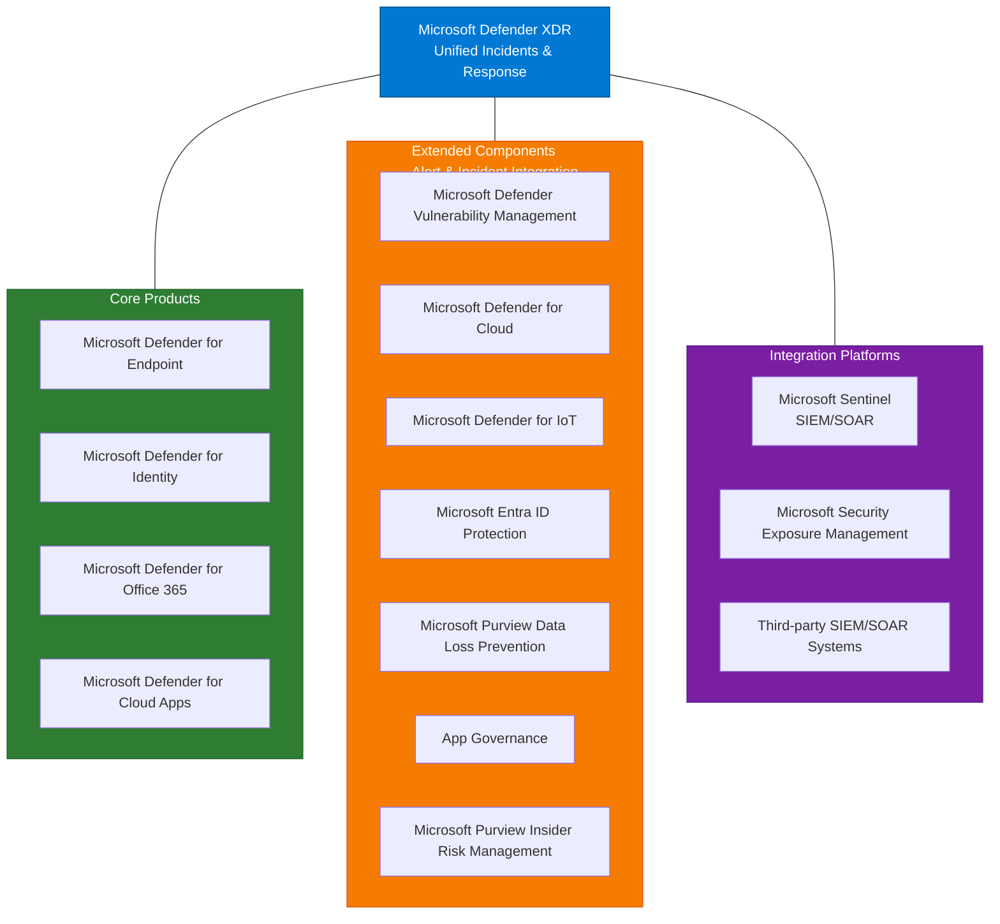

# Microsoft Defender XDR - Overview

## Document Information

| Item | Details |
|------|---------|
| **Product** | Microsoft Defender XDR |
| **Document Type** | Overview |
| **Last Updated** | YYYY-MM-DD |
| **Author** | [Author Name] |
| **Version** | 1.0 |

---

## Executive Summary

Microsoft Defender XDR (Extended Detection and Response) is a unified pre- and post-breach enterprise defense suite that natively coordinates detection, prevention, investigation, and response across endpoints, identities, email, and applications to provide integrated protection against sophisticated attacks.

## Purpose

This document provides a high-level overview of Microsoft Defender XDR, including:

- Product capabilities and value proposition
- Integration with other Microsoft Defender products
- Licensing requirements
- Key use cases

## Scope

### In Scope

- Microsoft Defender XDR portal and unified capabilities
- Integration with Defender for Endpoint, Identity, Office 365, and Cloud Apps
- Unified incident management
- Automated investigation and response
- Advanced hunting capabilities

### Out of Scope

- Detailed configuration procedures (see [Low-Level Design](03-Low-Level-Design.md))
- Individual product architectures (see respective product documentation)

## Product Description

### What is Defender XDR?

**Microsoft Defender XDR** is a modern, unified security operations platform that brings together multiple capabilities and covers the following workloads:

- **Identities** (both Cloud and On-premises)
- **Endpoints** (both Cloud and On-premises)
- **Email**
- **Cloud Application Data**

### Core Features

| Feature | Description |
|---------|-------------|
| **Unified Defense** | Brings together different security tools into a single platform, making it easier to manage and respond to threats |
| **Broad Protection** | Safeguards various areas like endpoints (computers), identities (users), email, and cloud applications |
| **Coordinated Detection and Response** | Connects the dots between different security signals to identify and stop attacks faster |
| **Combined Incident Queue** | Unified view of all security incidents across products |
| **Automated Response** | Self-healing capabilities for confirmed threats |
| **Cross-Product Threat Hunting** | Query across all Defender data sources using KQL |
| **Threat Analytics** | Curated intelligence reports on active campaigns |

Microsoft Defender XDR is a unified security operations platform that:

1. **Correlates alerts** across multiple security products into unified incidents
2. **Automates investigation** of complex attack chains
3. **Provides advanced hunting** with cross-product query capabilities
4. **Enables coordinated response** across all integrated products

### Key Value Propositions

| Value | Description |
|-------|-------------|
| **Unified View** | Single pane of glass for all security alerts and incidents |
| **Reduced Alert Fatigue** | Automatic correlation reduces alert volume by up to 90% |
| **Faster Response** | Automated investigation accelerates mean time to respond |
| **Cross-Domain Visibility** | See attack chains spanning endpoints, email, identity, and apps |

## Integration Points

Defender XDR integrates with the following products:

## Licensing Requirements

### Required Licenses

| License | Description |
|---------|-------------|
| Microsoft 365 E5 | Full Defender XDR capabilities |
| Microsoft 365 E5 Security | Defender XDR without full M365 E5 |
| Microsoft 365 E3 + E5 Security Add-on | Alternative licensing path |

### License Comparison

| Feature | E3 | E5 | E5 Security Add-on |
|---------|----|----|-------------------|
| Unified Incidents | ❌ | ✅ | ✅ |
| Automated Investigation | ❌ | ✅ | ✅ |
| Advanced Hunting | ❌ | ✅ | ✅ |
| Threat Analytics | ❌ | ✅ | ✅ |

## Key Use Cases

1. **Security Operations Center (SOC)**
   - Unified incident queue
   - Cross-product investigation
   - Coordinated response actions

2. **Threat Hunting**
   - Proactive threat detection
   - Cross-domain queries
   - Custom detection rules

3. **Incident Response**
   - Automated investigation
   - Attack chain visualization
   - Remediation recommendations

4. **Compliance and Reporting**
   - Secure Score tracking
   - Threat analytics reporting
   - Executive dashboards

## Related Documentation

- [High-Level Design](02-High-Level-Design.md)
- [Low-Level Design](03-Low-Level-Design.md)
- [Capabilities](04-Capabilities.md)
- [Security Operations Schedule](../Processes/Security-Operations-Schedule.md) - Operational tasks (daily, weekly, monthly)
- [Incident Response Process](../Processes/Incident-Response.md)

## References

- [Microsoft Defender XDR Documentation](https://learn.microsoft.com/en-us/microsoft-365/security/defender/)
- [What is Microsoft Defender XDR?](https://learn.microsoft.com/en-us/microsoft-365/security/defender/microsoft-365-defender)

---

## Document Control

| Version | Date | Author | Changes |
|---------|------|--------|---------|
| 1.0 | YYYY-MM-DD | [Author] | Initial creation |
