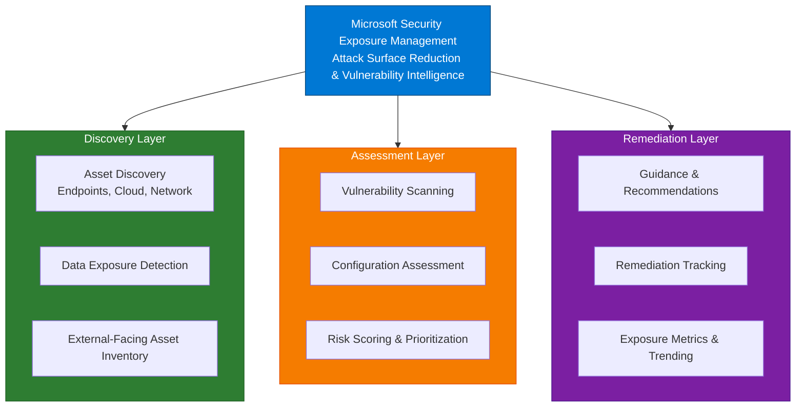

# Microsoft Security Exposure Management

## Document Information

| Item | Details |
|------|---------|
| **Product** | Microsoft Security Exposure Management |
| **Last Updated** | November 30, 2025 |
| **Author** | Security Architecture |
| **Version** | 1.0 |

---

## Purpose

This document covers Microsoft Security Exposure Management and its integrated Vulnerability Management capabilities, which together deliver comprehensive asset discovery, visibility, and risk-based remediation across hybrid and multi-cloud environments.

## Overview

Microsoft Security Exposure Management provides organizational attack surface reduction by discovering assets and data, assessing security posture, and prioritizing remediation based on risk and exploitability. Integrated Vulnerability Management (formerly Defender Vulnerability Management) extends this with continuous scanning and threat intelligence correlation.



---

## Core Capabilities

### 1. Asset Discovery & Inventory

| Capability | Description |
|------------|-------------|
| **Comprehensive Discovery** | Automated discovery across hybrid and multi-cloud environments |
| **Endpoints** | Windows, macOS, Linux, Android, iOS devices |
| **Network Devices** | Switches, routers, firewalls, and network infrastructure |
| **Cloud Infrastructure** | Azure VMs, AWS EC2, GCP Compute instances |
| **Web Assets** | External-facing web applications and services |
| **Data Repositories** | Cloud storage, databases, and sensitive data locations |
| **Continuous Monitoring** | Real-time asset detection and classification |

### 2. Vulnerability Management

Integrated Microsoft Defender Vulnerability Management (DVM) capabilities:

| Capability | Description |
|------------|-------------|
| **Continuous Scanning** | Automated vulnerability scanning across all assets |
| **Software Inventory** | Complete catalog of installed software and versions |
| **Patch Status** | Real-time tracking of patch deployment and compliance |
| **Threat Intelligence** | Correlation with emerging threats and CVEs |
| **CVSS Scoring** | Standardized severity assessment for all vulnerabilities |
| **Breach Likelihood** | ML-powered prediction of exploitation probability |
| **Zero-Day Context** | Emerging threat correlation with on-premise vulnerabilities |

### 3. Risk Assessment & Prioritization

| Capability | Description |
|------------|-------------|
| **Risk Scoring** | ML-based prioritization using multiple signals |
| **Exploitability** | Active exploitation in the wild detection |
| **Threat Intelligence** | Known attacker techniques and targets |
| **Asset Criticality** | Business importance and role-based prioritization |
| **Configuration Assessment** | Security baseline and hardening analysis |
| **MITRE Mapping** | Attack technique correlation and coverage |

### 4. External Attack Surface Management

| Capability | Description |
|------------|-------------|
| **External Asset Discovery** | Attacker-perspective visibility of your organization |
| **Exposed Data Detection** | Identification of publicly exposed sensitive data |
| **Domain Inventory** | All domains, subdomains, and digital assets |
| **SSL/Certificate Analysis** | Certificate expiration and misconfiguration detection |
| **DNS Records** | DNS misconfigurations and unauthorized entries |
| **IP Space Management** | Rogue or unmanaged IP address identification |

### 5. Remediation Guidance & Tracking

| Capability | Description |
|------------|-------------|
| **Prioritized Recommendations** | Risk-based remediation guidance |
| **Step-by-Step Guidance** | Detailed remediation instructions with screenshots |
| **Remediation Workflows** | Approval workflows and status tracking |
| **Mitigation Options** | Multiple remediation paths based on environment |
| **Impact Assessment** | Business impact analysis for remediation decisions |
| **Completion Tracking** | Real-time remediation progress visibility |

---

## Architecture

### Signal Sources

```
┌───────────────────────────────────────────────────────────────┐
│ Data Collection & Processing                                  │
├───────────────────────────────────────────────────────────────┤
│                                                                │
│  ┌──────────────┐   ┌──────────────┐   ┌──────────────┐      │
│  │ Endpoint     │   │ Cloud APIs   │   │ Network      │      │
│  │ Sensors      │   │ (Azure/AWS)  │   │ Telemetry    │      │
│  │ (MDE/EDR)    │   │              │   │              │      │
│  └──────┬───────┘   └──────┬───────┘   └──────┬───────┘      │
│         │                  │                   │               │
│         └──────────────────┼───────────────────┘               │
│                            │                                   │
│                  ┌─────────▼────────┐                          │
│                  │ Exposure Mgmt    │                          │
│                  │ Processing Engine│                          │
│                  └─────────┬────────┘                          │
│                            │                                   │
│         ┌──────────────────┼──────────────────┐               │
│         │                  │                  │               │
│    ┌────▼─────┐   ┌────────▼────┐   ┌───────▼──┐           │
│    │ Vuln DB  │   │ Risk Scoring│   │ Exposure │           │
│    │ & CVSS   │   │ Engine      │   │ Metrics  │           │
│    └────┬─────┘   └────────┬────┘   └───────┬──┘           │
│         │                  │                  │               │
│         └──────────────────┼──────────────────┘               │
│                            │                                   │
│                   ┌────────▼─────────┐                        │
│                   │ Risk Dashboard & │                        │
│                   │ Recommendations  │                        │
│                   └──────────────────┘                        │
│                                                                │
└───────────────────────────────────────────────────────────────┘
```

### Integration Points

**With Defender for Endpoint:**
- Continuous vulnerability data from MDE agents
- Remediation actions through device management
- Threat intelligence correlation

**With Microsoft Defender XDR:**
- Incident enrichment with exposure context
- Exposure-based incident correlation
- Coordinated response with vulnerability remediation

**With Microsoft Defender for Cloud:**
- Cloud workload vulnerability data
- Multi-cloud asset inventory
- Shared vulnerability scoring

---

## Vulnerability Management Deep Dive

### Supported Platforms

| Platform | Agents | Coverage |
|----------|--------|----------|
| **Windows** | MDE Agent (Defender/3rd-party EDR) | Full OS + software scan |
| **macOS** | MDE Agent | Full OS + software scan |
| **Linux** | MDE Agent | Full OS + software scan |
| **Android** | Microsoft Intune/MDM | Mobile app inventory |
| **iOS** | Microsoft Intune/MDM | Mobile app inventory |
| **Network** | Network discovery sensors | Network device inventory |
| **Cloud** | Cloud API connectors | IaaS vulnerability scanning |

### Vulnerability Scoring Matrix

```
┌──────────────────────────────────────────────────────────────┐
│ Scoring Factors (Machine Learning Model)                     │
├──────────────────────────────────────────────────────────────┤
│                                                               │
│ CVSS Base Score (40%)      ──┐                               │
│ ├─ Severity (Critical/High) │                               │
│ ├─ Attack Vector           │                               │
│ └─ Privileges Required     │                               │
│                             ├─→ Risk Score                  │
│ Threat Intelligence (35%)  │   (1-100)                     │
│ ├─ Active Exploitation    │                               │
│ ├─ Zero-day Status        │                               │
│ └─ Attacker Capability    │                               │
│                             │                               │
│ Asset Context (25%)        │                               │
│ ├─ Asset Criticality      ┘                               │
│ ├─ Exposure Level                                           │
│ └─ Remediation Difficulty                                   │
│                                                               │
└──────────────────────────────────────────────────────────────┘
```

### Remediation Workflow

```
1. Vulnerability Detected
   ├─ Automated scanning identifies CVE
   ├─ CVSS and threat intelligence correlation
   └─ Risk score generated (1-100)
        │
        ▼
2. Prioritization & Recommendation
   ├─ Risk-based ranking created
   ├─ Remediation options identified
   └─ Business impact assessed
        │
        ▼
3. Remediation Planning
   ├─ Approval workflow initiated
   ├─ Phased rollout planning
   └─ Prerequisite validation
        │
        ▼
4. Deployment
   ├─ Patch/upgrade deployment
   ├─ Configuration changes applied
   └─ Remediation actions tracked
        │
        ▼
5. Verification & Closure
   ├─ Rescan confirms remediation
   ├─ Metrics updated
   └─ Incident closed
```

---

## Risk Prioritization Model

### Exposure Score

Calculated for each asset/vulnerability combination:

```
Exposure Score = (CVSS × 0.4) + (Threat Signal × 0.35) + (Criticality × 0.25)

Where:
  • CVSS: Industry standard 1-10 score
  • Threat Signal: Active exploitation, zero-day, trending (1-10)
  • Criticality: Asset importance, workload role (1-10)
```

### Prioritization Tiers

| Tier | Score | Action | Timeline |
|------|-------|--------|----------|
| **Critical** | 90-100 | Immediate remediation | 0-24 hours |
| **High** | 70-89 | Urgent remediation planning | 1-7 days |
| **Medium** | 50-69 | Standard remediation | 1-30 days |
| **Low** | 1-49 | Scheduled remediation | 30+ days |

---

## External Attack Surface Management

### Discovery Methods

| Method | Coverage | Frequency |
|--------|----------|-----------|
| **DNS Enumeration** | Domain & subdomains | Continuous |
| **IP Space Analysis** | Owned IP ranges | Weekly |
| **SSL Certificate Monitoring** | Domain certificates | Real-time |
| **WHOIS Data** | Domain registrations | Weekly |
| **Public Repositories** | GitHub, pastebin, etc. | Continuous |
| **Web Crawling** | External web assets | Weekly |
| **Third-party DBs** | Shodan, Censys data | Weekly |

### Data Exposure Detection

Identifies sensitive data exposed to the internet:

- **Credentials** - API keys, passwords, tokens
- **PII** - Social security numbers, email addresses
- **Financial Data** - Credit card numbers, banking info
- **Intellectual Property** - Source code, technical docs
- **Configuration Data** - System configs, API endpoints
- **Infrastructure Details** - Server banners, service versions

---

## Licensing & Bundling

### Licensing Options

| License | Exposure Mgmt | DVM | Best For |
|---------|--------------|-----|----------|
| **Microsoft 365 E5** | Available | Included | Enterprise |
| **Microsoft 365 E5 Security** | Available | Included | Security-focused |
| **MDE Plan 2 + Add-on** | Standalone | Included | Endpoint-centric |
| **Standalone Subscription** | Yes | Yes | Organizations not on M365 |

### Pricing Model

- **Per-asset licensing** - Annual subscription based on device count
- **Cloud workload licensing** - Per 10 compute cores (cloud assets)
- **Volume discounts** - Available for 500+ assets

---

## Integration with Defender XDR

### Incident Enrichment

When an incident is detected in XDR:

```
XDR Incident Investigation
├─ Pull Exposure Score for affected assets
├─ Identify relevant vulnerabilities
├─ Map to threat actor capabilities
├─ Prioritize remediation steps
└─ Link to exposure management portal for deep analysis
```

### Alert Correlation

High-exposure vulnerabilities on compromised assets trigger elevated incident severity:

```
Standard Alert: Suspicious process execution → Medium severity
+ High Exposure Score on asset                → Elevated to High
+ Critical vulnerability in running software → Elevated to Critical
```

### Coordinated Response

```
XDR Response Action
├─ Incident remediation (isolate, disable)
├─ Concurrent vulnerability remediation starts
├─ Tracking dashboard shows both remediations
└─ Completion verified when both are resolved
```

---

## Deployment Architecture

### Architecture Components

```
┌────────────────────────────────────────────────────────────┐
│ On-Premises Environment                                    │
├────────────────────────────────────────────────────────────┤
│                                                             │
│  ┌─────────────┐         ┌──────────────────┐            │
│  │ Windows/    │         │ Network Discovery│            │
│  │ Linux/      │────────→│ & Scanning       │            │
│  │ macOS       │         │ (Agentless)      │            │
│  │ Servers     │         └──────────┬───────┘            │
│  └─────────────┘                    │                    │
│                                      │                    │
│  ┌─────────────┐                    │                    │
│  │ MDE/Intune  │◄───────────────────┘                    │
│  │ Connected   │                                          │
│  └──────┬──────┘                                          │
│         │                                                 │
└─────────┼────────────────────────────────────────────────┘
│         │
│    ┌────▼─────────────────────────────────────────┐
│    │ Cloud: Exposure Management Service           │
│    │ ├─ Vulnerability DB & Scoring                │
│    │ ├─ Risk Analysis Engine                      │
│    │ ├─ External Asset Discovery                  │
│    │ └─ Dashboard & Reporting                     │
│    └────┬─────────────────────────────────────────┘
│         │
│    ┌────┴──────────────────────────────────────────┐
│    │ Integrated Components                         │
│    │ ├─ Microsoft Defender for Endpoint           │
│    │ ├─ Microsoft Defender XDR                    │
│    │ ├─ Microsoft Defender for Cloud              │
│    │ └─ Microsoft Entra ID Protection             │
│    └───────────────────────────────────────────────┘

┌────────────────────────────────────────────────────────────┐
│ Multi-Cloud Environment                                    │
├────────────────────────────────────────────────────────────┤
│                                                             │
│  ┌──────────────┐    ┌──────────────┐   ┌──────────────┐ │
│  │ Azure VMs    │    │ AWS EC2      │   │ GCP Instances│ │
│  │ + Scanning   │    │ + Scanning   │   │ + Scanning   │ │
│  └──────┬───────┘    └──────┬───────┘   └──────┬───────┘ │
│         │                   │                   │          │
│         └───────────────────┼───────────────────┘          │
│                             │                              │
│                      ┌──────▼──────┐                      │
│                      │ Cloud APIs  │                      │
│                      │ Integration │                      │
│                      └──────┬──────┘                      │
│                             │                              │
└─────────────────────────────┼──────────────────────────────┘
                              │
                         [Exposure Management Service]
```

---

## Remediation Guidance Examples

### Windows Update Remediation

```
Vulnerability: CVE-2024-1234 (Critical CVSS 9.8)
Affected: 150 Windows Server 2019 instances
Risk Score: 98/100 (Critical)

Recommended Remediation:
1. Prerequisites Check
   ├─ Backup system state
   ├─ Verify disk space (5GB minimum)
   └─ Disable antivirus scanning during update

2. Deployment Strategy
   ├─ Phase 1: Test environment (5 servers) - Week 1
   ├─ Phase 2: Non-production (45 servers) - Week 2
   ├─ Phase 3: Production (100 servers) - Week 3
   └─ Rollback plan: System state restore within 2 hours

3. Verification
   ├─ Windows Update history confirmation
   ├─ Patch KB verification
   ├─ Rescan for vulnerability removal
   └─ Performance baseline validation
```

### Application Upgrade Remediation

```
Vulnerability: Vulnerable OpenSSL version 1.0.2
Affected: 45 Linux servers, 120 applications
Risk Score: 85/100 (High)

Mitigation Options:
Option A: Upgrade OpenSSL (Recommended)
├─ Timeline: 2 weeks
├─ Application restart required
├─ Vendor support confirmed
└─ Risk: Low

Option B: WAF Rule + Network Segmentation
├─ Timeline: 2 days
├─ No application changes
├─ Requires network redesign
└─ Risk: Partial mitigation only
```

---

## Metrics & Dashboards

### Key Performance Indicators (KPIs)

| KPI | Target | Measurement |
|-----|--------|-------------|
| **Exposure Score** | <30 | Organization-wide risk metric |
| **Critical Vuln Time to Fix** | <24 hours | Average days to resolve |
| **Patch Deployment Rate** | >95% | % of patches deployed |
| **Scan Coverage** | 100% | % of assets scanned |
| **External Exposure %** | <5% | % of assets exposed externally |

### Dashboard Sections

1. **Exposure Summary** - Organization risk score and trending
2. **Top Vulnerabilities** - Highest risk issues requiring attention
3. **Asset Exposure** - Per-asset vulnerability inventory
4. **Remediation Pipeline** - Active and planned remediations
5. **External Attacks** - Publicly exposed assets and data
6. **Compliance** - Regulatory requirement fulfillment

---

## Related Documentation

- [Defender XDR Overview](01-Overview.md)
- [High-Level Design](02-High-Level-Design.md)
- [Low-Level Design](03-Low-Level-Design.md)
- [Capabilities](04-Capabilities.md)
- [Multi-Cloud Strategy](06-Multi-Cloud-Strategy.md)
- [Alert & Incident Integration](10-Alert-and-Incident-Integration.md)

---

## References

- [Microsoft Security Exposure Management](https://learn.microsoft.com/en-us/security-exposure-management)
- [Microsoft Defender Vulnerability Management](https://learn.microsoft.com/en-us/defender-vulnerability-management)
- [CVE Database](https://cve.mitre.org)
- [CVSS Calculator](https://www.first.org/cvss/calculator/3.1)
- [Microsoft Defender for Endpoint](https://learn.microsoft.com/en-us/defender-endpoint)

---

## Document Control

| Version | Date | Author | Changes |
|---------|------|--------|---------|
| 1.0 | November 30, 2025 | Security Architecture | Initial creation |
