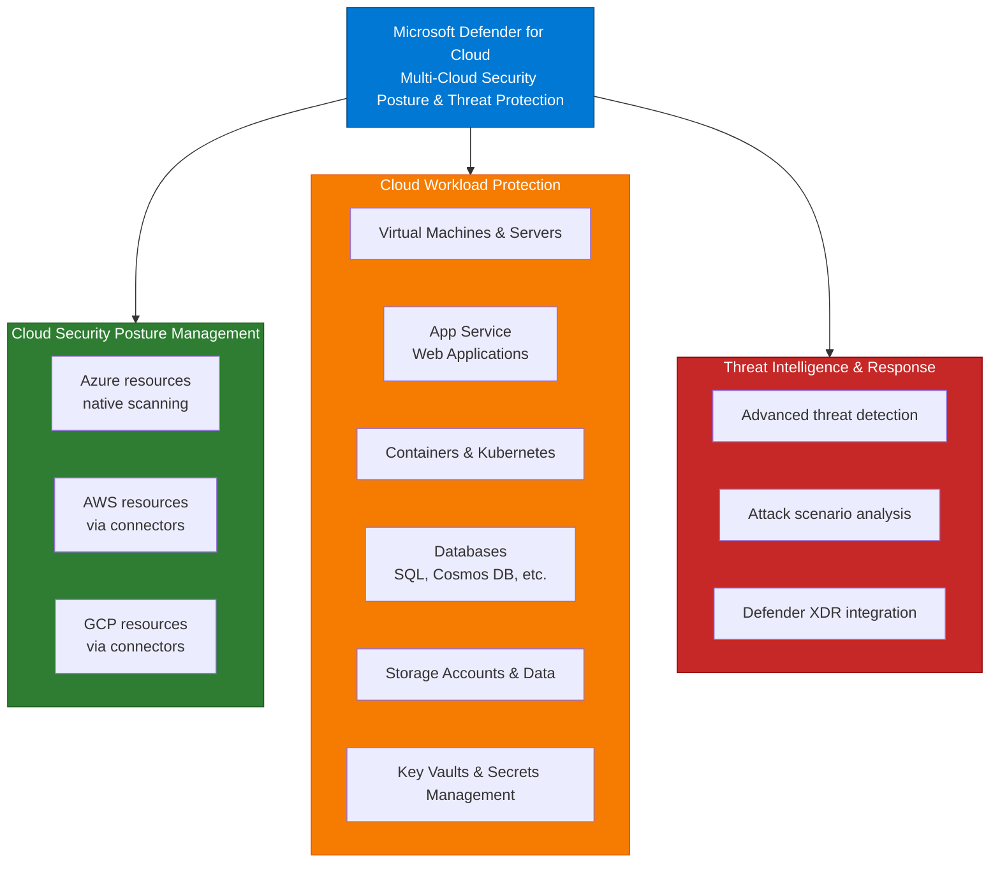
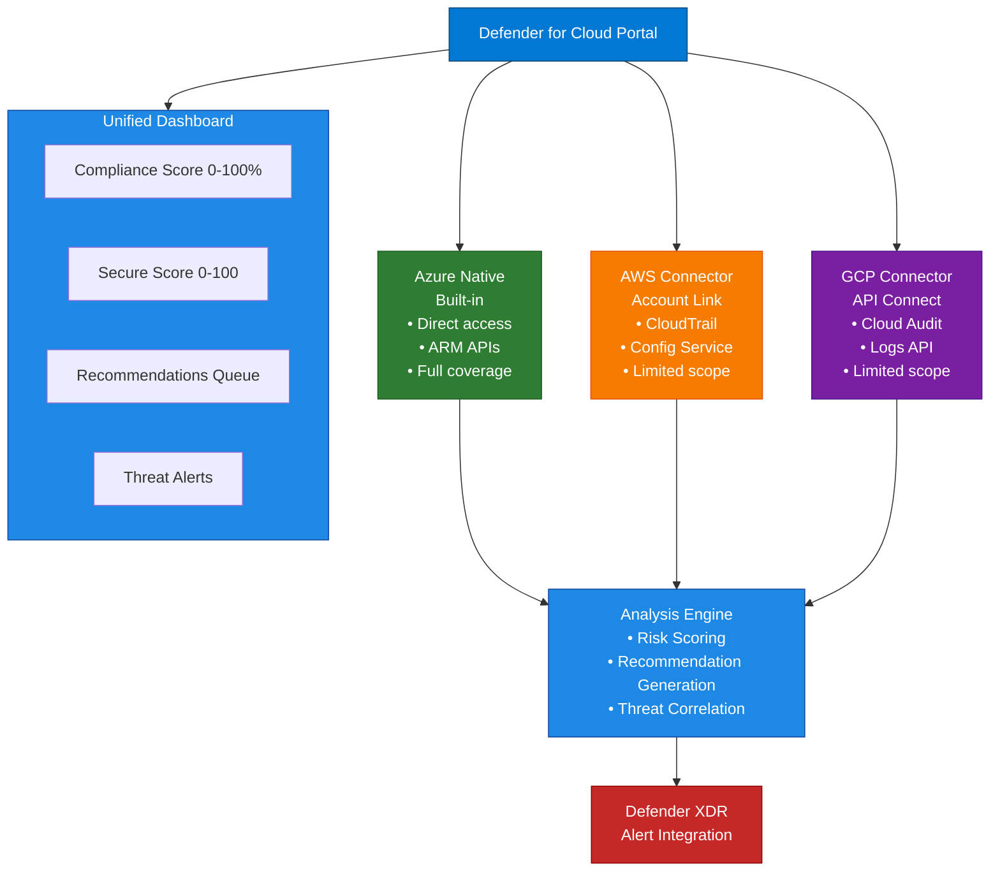

# Microsoft Defender for Cloud - Multi-Cloud Strategy

## Document Information

| Item | Details |
|------|---------|
| **Product** | Microsoft Defender for Cloud |
| **Last Updated** | November 30, 2025 |
| **Author** | Security Architecture |
| **Version** | 1.0 |

---

## Purpose

This document covers Microsoft Defender for Cloud, which delivers unified security posture management and workload threat protection across Azure, AWS, and GCP environments, with integrated alert and incident management with Microsoft Defender XDR.

## Overview

Microsoft Defender for Cloud provides cloud security posture management (CSPM) and cloud workload protection platform (CWPP) capabilities across multi-cloud environments. It combines asset discovery, configuration assessment, vulnerability scanning, and advanced threat detection to protect cloud infrastructure and applications.



---

## Core Capabilities

### 1. Cloud Security Posture Management (CSPM)

| Capability | Description |
|------------|-------------|
| **Asset Inventory** | Discovery of all cloud resources and configuration |
| **Configuration Assessment** | Evaluation against security best practices and standards |
| **Compliance Monitoring** | Real-time tracking against regulatory requirements |
| **Risk Scoring** | Aggregate cloud security score across resources |
| **Misconfiguration Detection** | Identification of insecure resource configurations |
| **Recommendation Engine** | Prioritized guidance for remediation |
| **Governance Tracking** | Azure Policy integration for compliance enforcement |

### 2. Cloud Workload Protection (CWPP)

#### Virtual Machine & Server Protection

| Capability | Description |
|------------|-------------|
| **EDR Integration** | Microsoft Defender for Endpoint deployment on VMs |
| **Vulnerability Scanning** | OS and application vulnerability assessment |
| **Threat Detection** | ML-based detection of suspicious activities |
| **Log Analytics Integration** | Collection and analysis of security events |
| **Baseline Enforcement** | CIS Benchmarks and Azure Security Benchmark validation |
| **Just-in-Time Access** | Network isolation with temporary access windows |

#### Container Protection

| Capability | Description |
|------------|-------------|
| **Registry Scanning** | Vulnerability scanning of container images |
| **Runtime Protection** | Detection of suspicious container activities |
| **Kubernetes Security** | Pod security policies and network policies |
| **Image Assessment** | Pre-deployment container image analysis |
| **Workload Isolation** | Container escape and privilege escalation detection |
| **Supply Chain Security** | Container build pipeline vulnerability tracking |

#### Database Protection

| Capability | Description |
|------------|-------------|
| **Threat Detection** | SQL injection, brute force, anomalous access patterns |
| **Vulnerability Assessment** | Database configuration and permission auditing |
| **Data Discovery** | Sensitive data classification and tagging |
| **Auditing** | SQL audit trail collection and retention |
| **Advanced Threat Protection** | ML-powered threat detection for SQL databases |

#### Application Protection

| Capability | Description |
|------------|-------------|
| **App Service Scanning** | Web application configuration assessment |
| **API Protection** | API security and abuse detection |
| **Web Application Firewall** | Integration with Azure WAF for DDoS/attack mitigation |
| **Function App Security** | Serverless function security assessment |
| **CORS & Auth Validation** | Cross-origin resource sharing and authentication checks |

### 3. Advanced Threat Detection

| Capability | Description |
|------------|-------------|
| **Anomaly Detection** | ML-based detection of unusual resource behavior |
| **Attack Scenario Discovery** | Lateral movement and attack path analysis |
| **Privilege Escalation Detection** | Unauthorized privilege changes |
| **Data Exfiltration Detection** | Unusual data access and transfer patterns |
| **Cryptomining Detection** | Unauthorized compute resource consumption |
| **Ransomware Protection** | Mass encryption and suspicious file operations |

### 4. Compliance Management

| Capability | Description |
|------------|-------------|
| **Framework Assessment** | Regulatory compliance evaluation (PCI-DSS, HIPAA, SOC 2, GDPR, NIST) |
| **Compliance Reports** | Automated compliance status reporting |
| **Standards Mapping** | Security recommendations mapped to compliance requirements |
| **Gap Identification** | Missing controls identification |
| **Audit Trail** | Complete compliance documentation for audits |
| **Continuous Monitoring** | Real-time compliance status tracking |

---

## Architecture

### Multi-Cloud Topology



### Data Flow

```
Cloud Resource Configuration & Telemetry
├─ VM/Container logs
├─ Network events
├─ API calls
├─ Database queries
└─ Storage access
      │
      ▼
Collection & Normalization
├─ Event parsing
├─ Schema mapping
├─ Timestamp correlation
└─ Data deduplication
      │
      ▼
Analysis Engine
├─ Configuration evaluation
├─ Baseline comparison
├─ Anomaly detection
├─ Threat correlation
└─ Risk calculation
      │
      ├─────────────────────────┬──────────────────────┐
      ▼                         ▼                      ▼
   Alerts              Recommendations          Security Score
   (Threats)          (Improvements)          (Organization-wide)
```

---

## Compliance Framework Integration

### Supported Standards

| Standard | Coverage | Assessment |
|----------|----------|------------|
| **PCI-DSS 3.2.1** | Payment card data security | Continuous |
| **HIPAA** | Healthcare data protection | Continuous |
| **SOC 2 Type II** | Service organization controls | Continuous |
| **GDPR** | EU data protection | Continuous |
| **NIST 800-53** | US government security controls | Continuous |
| **ISO 27001** | Information security management | Continuous |
| **Azure Security Benchmark** | Microsoft best practices | Continuous |
| **CIS Benchmarks** | Center for Internet Security | Continuous |

### Compliance Score Calculation

```
Compliance Score (0-100%) = 
    (Passed Controls / Total Controls) × 100

Example - PCI-DSS Assessment:
├─ Total Controls: 250
├─ Passed Controls: 220
├─ Failed Controls: 30
└─ Compliance Score: 88%

Failed controls mapping:
├─ Critical: 15 controls (remediate immediately)
├─ High: 10 controls (remediate within 30 days)
└─ Medium: 5 controls (remediate within 90 days)
```

---

## Threat Protection Layers

### Layer 1: Configuration Analysis

```
Resource Created/Modified
├─ Capture configuration
├─ Compare against baselines
├─ Check compliance frameworks
└─ Generate recommendations
```

### Layer 2: Runtime Monitoring

```
Continuous Activity Monitoring
├─ Process execution
├─ Network connections
├─ File access patterns
├─ Database queries
└─ API calls
      │
      ▼
Baseline Comparison
├─ Normal = No alert
├─ Anomalous = Investigate
└─ Malicious pattern = Alert
```

### Layer 3: Advanced Threat Analysis

```
Multi-Signal Correlation
├─ Endpoint signals
├─ Network signals
├─ Application signals
├─ Identity signals
└─ Data signals
      │
      ▼
Attack Scenario Detection
├─ Lateral movement attempts
├─ Privilege escalation attempts
├─ Data exfiltration attempts
└─ Persistence mechanism detection
```

---

## Azure Native Assessment

### Resource Configuration Scanning

Continuous assessment of Azure resources:

| Resource Type | Assessed Properties | Remediation |
|---------------|-------------------|-------------|
| **VMs** | OS hardening, updates, antivirus, disk encryption | Automated scripts |
| **App Service** | HTTPS, auth, CORS, managed identity | Portal recommendations |
| **Storage Accounts** | Access level, TLS version, encryption | Policy enforcement |
| **SQL Databases** | Threat detection, auditing, encryption, access | Built-in settings |
| **Network** | NSG rules, DDoS protection, firewall | Network recommendations |
| **Key Vault** | Soft-delete, purge protection, audit logging | Access policies |

### Azure Policy Integration

```
Defender for Cloud Recommendation
├─ Identified: Resource misconfiguration
├─ Create Azure Policy
├─ Deploy to subscription scope
├─ Enforce automatically
└─ Track compliance over time
```

---

## Multi-Cloud Assessment

### AWS Connector Capabilities

**Prerequisites:**
- AWS account access
- CloudTrail enabled
- AWS Config enabled

**Assessment Coverage:**
- EC2 security groups and network ACLs
- IAM roles and policies
- RDS database security
- S3 bucket public access
- CloudFront configurations
- Lambda function security

### GCP Connector Capabilities

**Prerequisites:**
- GCP project access
- Cloud Audit Logs enabled
- Service account permissions

**Assessment Coverage:**
- Compute Engine firewall rules
- IAM roles and service accounts
- Cloud SQL security
- Cloud Storage bucket permissions
- VPC network configurations
- Container Registry security

---

## Advanced Hunting & Investigation

### Attack Scenario Discovery

When unusual activity detected:

```
Initial Detection: Suspicious process execution on VM
├─ Endpoint: Agent detection of suspicious process
├─ Network: Unusual outbound connection to external IP
├─ Identity: Process running under suspicious service account
└─ Timeline: Activity occurs during non-business hours
      │
      ▼
Correlation Analysis
├─ Process behavior: Similar to known ransomware
├─ Network: Connecting to known C2 infrastructure
├─ Identity: Service account recently compromised
└─ Timeline: Matches ransomware deployment window
      │
      ▼
Attack Scenario Identified: Ransomware Deployment Attempt
├─ Severity: CRITICAL
├─ Confidence: HIGH
├─ Recommendation: Isolate VM immediately
└─ Create XDR Incident: Link to identity compromise
```

### Investigation Tools

| Tool | Purpose | Data Source |
|------|---------|-------------|
| **Resource Explorer** | View resource configuration history | ARM audit logs |
| **Activity Log** | See all resource modifications | Azure Activity Log |
| **Network Analyzer** | Analyze network flows and connections | NSG flow logs |
| **Query Editor** | Run custom KQL queries | Log Analytics |

---

## Integration with Defender XDR

### Alert Integration

Defender for Cloud alerts automatically flow to Defender XDR:

```
Defender for Cloud Detection
├─ Anomalous API calls
├─ Privilege escalation attempt
└─ Unusual resource creation
      │
      ▼
Create Alert
├─ Title: "Suspicious API activity detected"
├─ Resource: /subscriptions/xxx/resourceGroups/yyy
├─ Severity: High
└─ Alert ID: DFC-2024-001234
      │
      ▼
Defender XDR Incident
├─ Incoming Alert: Defender for Cloud
├─ Correlation: Check endpoint/identity alerts
├─ Create/Update: XDR Incident #12345
├─ Timeline: Add to incident investigation
└─ Response: Single incident response workflow
```

### Coordinated Response

```
XDR Incident Response
├─ Isolate affected VM (Defender for Cloud action)
├─ Disable compromised identity (Entra ID action)
├─ Block malicious IP (Network rule action)
├─ Collect forensics (MDE response)
└─ Close incident when all actions complete
```

### Incident Context

When investigating XDR incident involving cloud resource:

```
Incident Investigation
├─ Timeline
│  ├─ 14:22 - Suspicious process execution (MDE)
│  ├─ 14:23 - API call to disable auditing (DFC)
│  ├─ 14:24 - Data exfiltration detected (MDO)
│  └─ 14:25 - Account lockout triggered (MDI)
│
├─ Evidence
│  ├─ Process: cmd.exe /c "Disable-AzureRmDiagnosticSetting"
│  ├─ Identity: Service account running process
│  ├─ Network: Data sent to external IP
│  └─ Cloud: Azure resources accessed without authorization
│
├─ Correlation
│  ├─ Threat actor playbook: Disable logging then exfiltrate
│  ├─ All signals point to insider threat
│  └─ Recommend immediate account suspension
│
└─ Response
   ├─ Disable service account
   ├─ Force MFA on all user accounts
   ├─ Collect forensics from VM
   └─ Review access logs for lateral movement
```

---

## Secure Score & KPIs

### Secure Score Calculation

```
Organization Secure Score (0-223 points maximum)

Score Components:
├─ Identity & Access (40 points)
│  ├─ MFA enabled: 10 points
│  ├─ Privileged accounts: 15 points
│  └─ Access reviews: 15 points
│
├─ Data & App Protection (50 points)
│  ├─ Encryption at rest: 15 points
│  ├─ Encryption in transit: 15 points
│  └─ Data governance: 20 points
│
├─ Compute & Network (60 points)
│  ├─ VM hardening: 20 points
│  ├─ Network segmentation: 20 points
│  └─ Threat protection: 20 points
│
└─ Application & Infrastructure (73 points)
   ├─ Compliance: 30 points
   ├─ Risk management: 25 points
   └─ Security monitoring: 18 points
```

### Score Trends & Targets

| Timeframe | Target | Actions |
|-----------|--------|---------|
| **Current** | ≥160/223 (72%) | Monitor recommendations |
| **30-day** | ≥170/223 (76%) | Prioritize high-value fixes |
| **90-day** | ≥185/223 (83%) | Implement phased remediation |
| **6-month** | ≥200/223 (90%) | Enterprise-grade security |

---

## Deployment Architecture

### Azure-Only Deployment

```
┌─────────────────────────────────────┐
│ Azure Subscription                   │
├─────────────────────────────────────┤
│                                      │
│  ┌──────────────────────────────┐  │
│  │ Resource Groups              │  │
│  │ ├─ Production RG             │  │
│  │ │  ├─ VMs                    │  │
│  │ │  ├─ App Services           │  │
│  │ │  ├─ SQL Databases          │  │
│  │ │  └─ Storage Accounts       │  │
│  │ │                             │  │
│  │ └─ Security RG               │  │
│  │    ├─ Log Analytics          │  │
│  │    ├─ Key Vault              │  │
│  │    └─ Automation Accounts    │  │
│  └──────────────┬───────────────┘  │
│                 │                   │
│                 ▼                   │
│         ┌───────────────┐          │
│         │ Defender for  │          │
│         │ Cloud         │          │
│         └───────┬───────┘          │
│                 │                   │
└─────────────────┼───────────────────┘
                  │
            [Defender XDR]
```

### Multi-Cloud Deployment

```
┌─────────────────┬──────────────────┬──────────────────┐
│ Azure           │ AWS Account      │ GCP Project      │
├─────────────────┼──────────────────┼──────────────────┤
│                 │                  │                  │
│ Native DFC      │ CloudTrail +     │ Cloud Audit Logs │
│ Assessment      │ Config Service   │ + API Enabled    │
│                 │ (limited scope)  │ (limited scope)  │
│                 │                  │                  │
└────────┬────────┴────────┬─────────┴────────┬─────────┘
         │                 │                  │
         └─────────────────┼──────────────────┘
                           │
                  ┌────────▼────────┐
                  │ Defender for    │
                  │ Cloud Connectors│
                  └────────┬────────┘
                           │
                      [Defender XDR]
```

---

## Licensing

### License Options

| License | Coverage | CWPP | Cost |
|---------|----------|------|------|
| **Free Tier** | Azure resources (limited) | No | Included |
| **Defender for Cloud Plan** | Full Azure + AWS/GCP | Yes | Per subscription |
| **Microsoft 365 E5** | Azure prioritized | Yes | Included |
| **Microsoft 365 E5 Security** | Same as E5 | Yes | Included |

### Plan Options

- **Per subscription** - Monthly/yearly billing
- **Per resource** - Based on resource count/type
- **Volume discounts** - Available for 10+ subscriptions

---

## Related Documentation

- [Defender XDR Overview](01-Overview.md)
- [High-Level Design](02-High-Level-Design.md)
- [Low-Level Design](03-Low-Level-Design.md)
- [Capabilities](04-Capabilities.md)
- [Security Exposure Management](05-Security-Exposure-Management.md)
- [Alert & Incident Integration](10-Alert-and-Incident-Integration.md)

---

## References

- [Microsoft Defender for Cloud Documentation](https://learn.microsoft.com/en-us/azure/defender-for-cloud)
- [Azure Security Best Practices](https://learn.microsoft.com/en-us/azure/security/fundamentals)
- [AWS Security Best Practices](https://docs.aws.amazon.com/security)
- [GCP Security Best Practices](https://cloud.google.com/security/best-practices)

---

## Document Control

| Version | Date | Author | Changes |
|---------|------|--------|---------|
| 1.0 | November 30, 2025 | Security Architecture | Initial creation |
