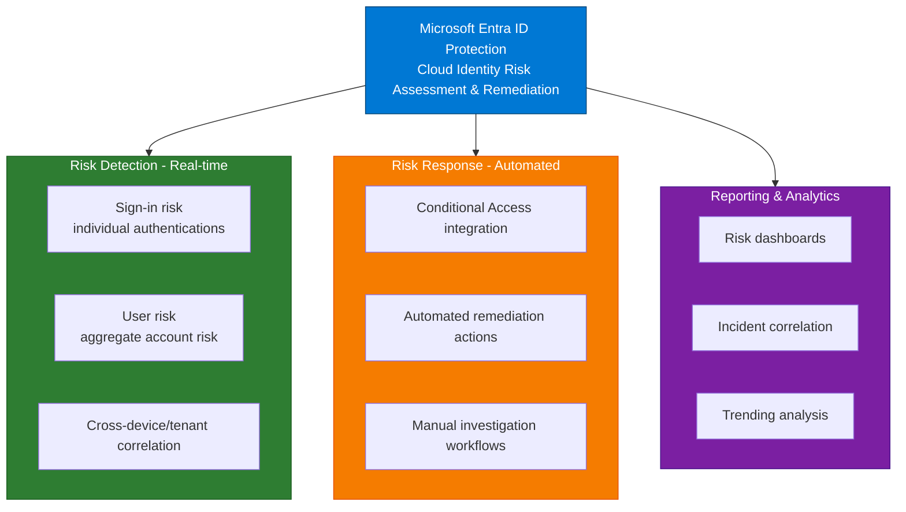

# Microsoft Entra ID Protection

## Document Information

| Item | Details |
|------|---------|
| **Product** | Microsoft Entra ID Protection |
| **Last Updated** | November 30, 2025 |
| **Author** | Security Architecture |
| **Version** | 1.0 |

---

## Purpose

This document covers Microsoft Entra ID Protection, which evaluates identity and sign-in risk using machine learning and threat intelligence to enable risk-based access decisions through Conditional Access integration with Microsoft Defender XDR.

## Overview

Microsoft Entra ID Protection analyzes signals from billions of sign-in attempts across Microsoft services to detect and respond to identity-based risks. It complements Defender for Identity (on-premises detection) by focusing on cloud sign-in events, modern authentication, and conditional access enforcement.



---

## Core Capabilities

### 1. Sign-in Risk Assessment

| Capability | Description |
|------------|-------------|
| **Real-time Evaluation** | Assess risk during authentication |
| **Anomaly Detection** | Unusual sign-in patterns vs. user baseline |
| **Location Analysis** | Impossible travel, unusual locations, VPN usage |
| **Device Risk** | Correlation with device compliance state |
| **Authentication Method** | Risk based on MFA presence/type |
| **Credential Leak Detection** | Passwords compromised in known breaches |
| **Brute Force Detection** | Multiple failed attempts from single source |

### 2. User Risk Assessment

| Capability | Description |
|------------|-------------|
| **Aggregate Risk Scoring** | Calculate user-level risk from multiple signals |
| **Behavioral Baseline** | Learn normal user sign-in patterns |
| **Risky Behavior Detection** | Unusual actions (mass downloads, unusual API calls) |
| **Compromised Credential Risk** | Leaked or known-compromised passwords |
| **Cross-Tenant Correlation** | Risk signals from other Microsoft tenants/services |
| **Time-Based Trending** | Identify escalating risk over time |

### 3. Conditional Access Integration

| Capability | Description |
|------------|-------------|
| **Risk-Based Policies** | Apply restrictions based on risk level |
| **MFA Requirement** | Require multi-factor authentication for high-risk events |
| **Session Duration** | Limit session length for risky access |
| **Compliance Requirement** | Require device compliance checks |
| **Location Blocking** | Restrict access from untrusted locations |
| **Legacy Auth Blocking** | Prevent weak authentication protocols |
| **App-Specific Rules** | Different policies per application |

### 4. Remediation & Response

| Capability | Description |
|------------|-------------|
| **Automatic Remediation** | Self-service password reset for compromised accounts |
| **MFA Challenge** | Require MFA re-registration on risky sign-in |
| **Session Termination** | Force sign-out from suspicious sessions |
| **Manual Investigation** | Portal investigation workflows |
| **Admin Actions** | Manual password reset or account suspension |
| **User Notifications** | Alert users to suspicious activity |
| **Forensic Tools** | Review historical activity and risk signals |

---

## Risk Detection Types

### A. Sign-in Risk Events

#### 1. Anomalous Sign-in Characteristics

```
Detected Pattern:
├─ User: john.smith@contoso.com
├─ Normal: Signs in from Seattle office (9-5 PM)
├─ Anomaly: Sign-in detected from Singapore (3 AM)
├─ Characteristic: Impossible travel (16+ hours in 2 hours)
└─ Signal: SUSPICIOUS
     │
     ▼
Risk Calculation:
├─ Base risk: Medium (anomalous location)
├─ Amplifier: Impossible travel (+High)
├─ Amplifier: Off-hours access (+Medium)
├─ Amplifier: Multiple failed attempts first (+High)
└─ Final: HIGH risk
     │
     ▼
Conditional Access Action:
├─ Requirement: MFA (additional verification)
├─ User sees: MFA challenge on mobile
├─ Result: User completes MFA
├─ Access: Granted if MFA succeeds
└─ Status: Sign-in recorded as "Risky but Remediated"
```

#### 2. Sign-in from Unfamiliar Location

```
Detection Process:
├─ Geographic Baseline: UK (95%), US (4%), Canada (1%)
├─ New Sign-in: From Russia (unfamiliar)
├─ Analysis: Unusual for this user
├─ Context: No active travel indication
└─ Signal: SUSPICIOUS (Medium)
     │
     ▼
Conditional Access Response:
├─ Check: Is device compliant? (No - personal device)
├─ Requirement: MFA + Device compliance
├─ Result: User registers device + completes MFA
└─ Access: Granted - new baseline location recorded
```

#### 3. Sign-in from IP with Suspicious Reputation

```
Detection Process:
├─ IP Source: 203.0.113.45
├─ Reputation Check: Known botnet address
├─ Associated Threats: Credential stuffing, brute force
├─ Threat Intelligence: Active exploitation attempts
└─ Signal: HIGH RISK
     │
     ▼
Conditional Access Response:
├─ Decision: BLOCK sign-in attempt
├─ User sees: "This sign-in has been blocked"
├─ Notification: Email alert to user account
├─ Recovery: User must approve from known device
└─ Status: Sign-in blocked and logged
```

#### 4. Credential Leak Detection

```
Detection Method:
├─ Source: Third-party breach (e.g., LinkedIn, Twitter)
├─ Leaked Credentials: john.smith@contoso.com + password
├─ Detection: Identity Protection scans databases
├─ Match: Found in tenant user accounts
└─ Signal: COMPROMISED CREDENTIAL
     │
     ▼
Automatic Remediation:
├─ Action 1: Force password change on next login
├─ Action 2: Terminate active sessions
├─ Action 3: Require MFA re-registration
├─ Notification: Send user alert
└─ Recovery: User must change password to access
```

### B. User Risk Events

#### 1. Multiple Risky Sign-ins (Brute Force)

```
Attack Scenario:
├─ Time: Within 5 minutes
├─ Attempts: 50 failed sign-in attempts
├─ Source: Single IP address (203.0.113.100)
├─ Target: Multiple user accounts (brute force)
└─ Signal: ACCOUNT UNDER ATTACK
     │
     ▼
Detection & Response:
├─ Real-time: Block IP after 10 failed attempts
├─ User notification: "Your account is under attack"
├─ Recommendation: Change password immediately
├─ Risk Level: CRITICAL - User risk elevated
└─ XDR Alert: Credential attack incident created
```

#### 2. Risky User Behavior (Mass Access)

```
Detected Behavior:
├─ User: administrative account
├─ Action: Accessed 500+ documents in 5 minutes
├─ Normal: Typical access < 20 docs per day
├─ Pattern: Similar to insider threat/exfiltration
└─ Signal: ABNORMAL BEHAVIOR
     │
     ▼
Risk Assessment:
├─ User risk: ELEVATED to HIGH
├─ Trigger: Insider Risk Management policy alert
├─ Investigation: Security team notified
├─ Recommendation: Review access logs
└─ Possible Cause: Compromised account or insider threat
```

#### 3. Compromised Password Detected

```
Scenario:
├─ Source: Known dark web password dump
├─ Password: Found in users.txt leak
├─ User: jane.doe@contoso.com
├─ Status: User unaware of compromise
└─ Signal: COMPROMISED ACCOUNT
     │
     ▼
Automatic Response:
├─ Action 1: Mark user as risky
├─ Action 2: Require password change on next login
├─ Action 3: Terminate existing sessions
├─ Action 4: Enforce MFA re-registration
├─ Notification: User informed via email
└─ Recovery: User changes password to restore access
```

---

## Architecture

### Detection Pipeline

```
┌────────────────────────────────────────────────────────────┐
│ Sign-In Request                                            │
│ (User attempts to authenticate)                            │
├────────────────────────────────────────────────────────────┤
│                                                             │
│           ┌────────────────────────────────┐              │
│           │ 1. Authentication Gateway       │              │
│           │    ├─ Capture credentials      │              │
│           │    └─ Verify identity          │              │
│           └──────────┬─────────────────────┘              │
│                      │                                     │
│           ┌──────────▼──────────────────┐                │
│           │ 2. Risk Assessment Engine    │                │
│           │    ├─ Location check         │                │
│           │    ├─ Device check           │                │
│           │    ├─ Behavior check         │                │
│           │    ├─ Credential check       │                │
│           │    └─ Threat intel check     │                │
│           └──────────┬─────────────────────┘              │
│                      │                                     │
│           ┌──────────▼──────────────────┐                │
│           │ 3. Risk Scoring              │                │
│           │    ├─ Low (1-33%)           │                │
│           │    ├─ Medium (34-66%)       │                │
│           │    └─ High (67-100%)        │                │
│           └──────────┬─────────────────────┘              │
│                      │                                     │
│          ┌───────────┼───────────┐                        │
│          ▼           ▼           ▼                        │
│      ┌───────┐  ┌────────┐  ┌───────┐                   │
│      │ Grant │  │Challenge│  │Block │                   │
│      │Access │  │ for MFA  │  │Access│                   │
│      └───────┘  └────────┘  └───────┘                   │
│                                                             │
│           ┌──────────────────────────────┐              │
│           │ 4. Logging & Alerting         │              │
│           │    ├─ Record decision         │              │
│           │    ├─ Track risk signal       │              │
│           │    └─ Alert if necessary      │              │
│           └──────────────────────────────┘              │
│                                                             │
└────────────────────────────────────────────────────────────┘
```

### User Risk Calculation

```
┌─────────────────────────────────────────────────────────┐
│ User Risk Scoring Model                                 │
├─────────────────────────────────────────────────────────┤
│                                                          │
│ Input Signals (weighted):                              │
│                                                          │
│ ┌─────────────────────────────────────────┐            │
│ │ Compromised Credentials        (35%)    │            │
│ │ ├─ Leaked password: +50 points          │            │
│ │ └─ In-use on other services: +30        │            │
│ └─────────────────────────────────────────┘            │
│                                                          │
│ ┌─────────────────────────────────────────┐            │
│ │ Risky Sign-ins                 (40%)    │            │
│ │ ├─ Anomalous location: +25 points       │            │
│ │ ├─ Impossible travel: +35 points        │            │
│ │ └─ Unfamiliar device: +15 points        │            │
│ └─────────────────────────────────────────┘            │
│                                                          │
│ ┌─────────────────────────────────────────┐            │
│ │ Suspicious Activity            (25%)    │            │
│ │ ├─ Brute force attempts: +30 points     │            │
│ │ ├─ Bulk user enumeration: +25           │            │
│ │ └─ Abnormal resource access: +20        │            │
│ └─────────────────────────────────────────┘            │
│                                                          │
│ ┌──────────────────────────────────────────────┐       │
│ │ Risk Score Calculation:                       │       │
│ │                                                │       │
│ │ Low (Green):    0-33%   → Allow access      │       │
│ │ Medium (Yellow): 34-66% → MFA required      │       │
│ │ High (Red):     67-100% → Block/Remediate   │       │
│ └──────────────────────────────────────────────┘       │
│                                                          │
└─────────────────────────────────────────────────────────┘
```

---

## Conditional Access Policies

### Policy Example 1: Location-Based Access

```
Policy Name: "Block High-Risk Countries"

Conditions:
├─ Sign-in Risk: High
├─ Location: North Korea, Iran, Syria, Crimea
└─ Applications: All cloud apps

Access Controls:
├─ Action: BLOCK
├─ Message: "Access denied from high-risk location"
└─ Notification: Security team alert

Result:
├─ User: Cannot access applications from these locations
├─ Remediation: VPN to trusted location required
└─ Admin: Review reason before allowing access
```

### Policy Example 2: Device Compliance Required

```
Policy Name: "Unmanaged Device + Risky Sign-in"

Conditions:
├─ Device: Not compliant with MDM
├─ Sign-in Risk: Medium or High
└─ Applications: Sensitive apps (email, SharePoint)

Access Controls:
├─ Requirement: Device must be compliant
├─ Alternative: Require MFA + Session duration limit 2 hours
└─ Monitor: Extra logging enabled

Result:
├─ Personal device: Cannot access sensitive apps
├─ Corporate device: Can access with restrictions
├─ Remediation: Enroll device in MDM
```

### Policy Example 3: Privileged Accounts

```
Policy Name: "Administrators - Strict MFA"

Conditions:
├─ Users: Global Admins, Exchange Admins, Security Admins
├─ Applications: All
└─ No exclusions

Access Controls:
├─ Require: MFA (with compliant device preferred)
├─ Session: 4-hour limit, re-auth required
├─ Monitor: Real-time anomaly detection
└─ Alert: Notify on any sign-in

Result:
├─ MFA always required for admin access
├─ Re-authentication prevents session hijacking
└─ Comprehensive logging for audit trail
```

---

## Comparison: Entra ID Protection vs. Defender for Identity

| Feature | Entra ID Protection | Defender for Identity |
|---------|-------------------|----------------------|
| **Data Source** | Cloud sign-in events | On-premises AD traffic |
| **Coverage** | Cloud-only identities | Hybrid & on-premises |
| **Detection Type** | Sign-in anomalies | Lateral movement, attacks |
| **Real-Time** | Yes (during auth) | Yes (continuous) |
| **Response** | Conditional Access | Investigation + manual |
| **Complexity** | Modern auth | Traditional AD |
| **Integration** | Conditional Access | Incident investigation |

### Deployment Model

```
┌─────────────────────────────────────┐
│ Hybrid Environment                   │
├─────────────────────────────────────┤
│                                      │
│ On-Premises Active Directory        │
│ └─ Defender for Identity            │
│    ├─ Detects: Lateral movement    │
│    ├─ Detects: Kerberos attacks    │
│    └─ Detects: AD enumeration      │
│         │                           │
│         ▼                           │
│ ┌──────────────────────────────┐   │
│ │ Entra ID (Sync)              │   │
│ │ └─ Entra ID Protection       │   │
│ │    ├─ Detects: Sign-in risk  │   │
│ │    ├─ Detects: Anomalies     │   │
│ │    └─ Enforces: CA policies  │   │
│ └──────────────────────────────┘   │
│         │                           │
└─────────┼───────────────────────────┘
          │
     [Unified Incident Investigation]
```

---

## Investigation Workflows

### Workflow: Risky User Investigation

```
Step 1: Alert Received
├─ Source: Entra ID Protection
├─ Type: User Risk Detected
├─ Trigger: Multiple risky sign-ins in 24 hours
└─ Status: Requires investigation

Step 2: Portal Investigation
├─ Open: Identity > Risky Users
├─ Review: Risk factors
│  ├─ Anomalous locations: 3
│  ├─ Leaked credentials: 1
│  ├─ Risky sign-ins: 12
│  └─ Risky behavior: Potential exfiltration
├─ Timeline: Review hourly activity
└─ Decision: User risk level = HIGH

Step 3: Gather Context
├─ Check: Defender for Identity alerts
├─ Check: Device compliance status
├─ Check: Insider Risk Management policies
├─ Check: Resource access logs
└─ Finding: Corroborate with endpoint data

Step 4: Determine Cause
├─ Hypothesis A: Account compromise (likely)
├─ Hypothesis B: Insider threat (possible)
├─ Hypothesis C: Legitimate travel (unlikely)
└─ Conclusion: Account likely compromised

Step 5: Remediation
├─ Action 1: Force password reset
├─ Action 2: Terminate all sessions
├─ Action 3: Require MFA re-registration
├─ Action 4: Review access permissions
├─ Action 5: Monitor for persistence

Step 6: Documentation
├─ Create: Incident record
├─ Link: To XDR incident #12345
├─ Notes: Investigation findings
├─ Status: Resolved or Escalated
└─ Timeline: Sent to security team
```

---

## Self-Service Password Reset (SSPR) Integration

### Remediation Flow

```
User Receives Risky Sign-In Alert
│
├─ Email Notification:
│  "Your account was involved in risky activity.
│   Click here to verify your identity."
│
▼
User Clicks Link (Secure Token)
│
├─ Verify: MFA challenge (phone, email, app)
│ └─ Confirm: It's really the user
│
▼
User Options:
├─ Option 1: "I Recognize This Activity" 
│            (User confirms access)
│            └─ Risk marked as "Remediated"
│
├─ Option 2: "I Don't Recognize This"
│            (User confirms compromise)
│            └─ Automatic password reset required
│
└─ Option 3: "Redirect to Change Password"
             (User initiates password change)
             └─ Immediate access restoration
```

---

## Integration with Defender XDR

### Alert Flow to XDR

```
Entra ID Protection Detection
├─ Type: High-risk user activity
├─ User: jane.doe@contoso.com
├─ Risk Signals:
│  ├─ Compromised credentials detected
│  ├─ Multiple anomalous sign-ins
│  └─ Unusual data access pattern
└─ Risk Level: HIGH
     │
     ▼
Entra ID Protection Alert
├─ Alert ID: AAD-Identity-Risk-001
├─ Severity: High
├─ Timestamp: 2025-11-30 14:22 UTC
└─ Status: Active
     │
     ▼
XDR Incident Correlation
├─ Check: Any MDE alerts on user's devices?
├─ Check: Any MDI alerts on user account?
├─ Check: Any MDO alerts from user's mailbox?
├─ Correlation: Found 2 endpoint alerts + 1 identity alert
└─ Decision: Create unified incident
     │
     ▼
XDR Incident Created
├─ Title: "Possible compromised user account"
├─ Severity: CRITICAL
├─ Evidence:
│  ├─ Entra ID Protection: Risk signals
│  ├─ MDE: Suspicious process execution
│  ├─ MDI: Kerberos attack detected
│  └─ Timeline: All within 30 minutes
├─ Recommendation: Immediate account disabling
└─ Status: Assigned for investigation
```

### Incident Context Display

When investigating incident in XDR:

```
Incident Investigation View:

Timeline:
├─ 14:18 - Entra ID Protection: Risky sign-in detected
├─ 14:19 - Defender for Identity: Kerberos attack detected  
├─ 14:20 - Defender for Endpoint: Suspicious process on user device
├─ 14:21 - Defender for Office 365: Large email forwarding rule created
└─ 14:22 - XDR: Unified incident created

Evidence:
├─ User Account: jane.doe@contoso.com
├─ Device: LAPTOP-ABC123
├─ Sign-in Location: Russia (anomalous)
├─ Attack Technique: Credential compromise
└─ Data Access: Attempted SharePoint access

Context:
├─ Entra ID Risk Assessment:
│  ├─ User Risk: HIGH (67-100%)
│  ├─ Factors: Leaked credential + risky sign-ins
│  └─ Recommendation: Disable account immediately
├─ Timeline: Attack progressed over 30 minutes
├─ Scope: Single user, multiple systems
└─ Impact: Data access possible, email rules modified

Recommended Actions:
├─ Immediate: Disable user account
├─ Immediate: Terminate all sessions
├─ Within 1 hour: Password reset + MFA re-registration
├─ Within 24 hours: Audit email forwarding rules
└─ Follow-up: Forensic investigation on device
```

---

## Licensing

### License Requirements

| Component | License |
|-----------|---------|
| **Entra ID Protection** | Microsoft Entra ID P2 |
| **Conditional Access** | Microsoft Entra ID P1 or P2 |
| **Included in** | Microsoft 365 E5 / A5 |

### Standalone Licensing

```
Option 1: Microsoft Entra ID P2
├─ License cost: $6/user/month (typical)
├─ Includes: All Entra ID features
└─ Support: Premier support available

Option 2: Microsoft 365 E5
├─ License cost: ~$35/user/month
├─ Includes: Office 365 + Entra ID P2 + Defender
└─ Best for: Organizations already on Microsoft 365
```

---

## Related Documentation

- [Defender XDR Overview](01-Overview.md)
- [High-Level Design](02-High-Level-Design.md)
- [Low-Level Design](03-Low-Level-Design.md)
- [Capabilities](04-Capabilities.md)
- [Defender for Identity](../03-Defender-for-Identity)
- [Alert & Incident Integration](10-Alert-and-Incident-Integration.md)

---

## References

- [Microsoft Entra ID Protection](https://learn.microsoft.com/en-us/azure/active-directory/identity-protection)
- [Conditional Access Policies](https://learn.microsoft.com/en-us/azure/active-directory/conditional-access)
- [Defender for Identity](https://learn.microsoft.com/en-us/defender-for-identity)
- [Zero Trust Architecture](https://learn.microsoft.com/en-us/security/zero-trust)

---

## Document Control

| Version | Date | Author | Changes |
|---------|------|--------|---------|
| 1.0 | November 30, 2025 | Security Architecture | Initial creation |
