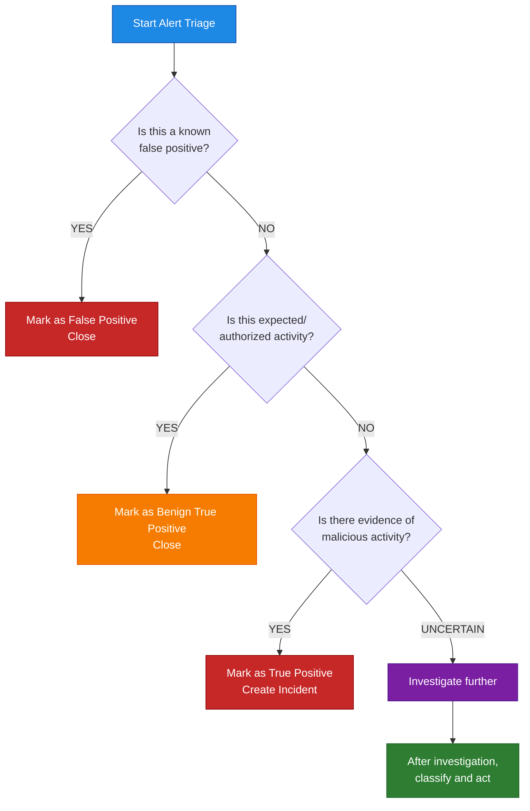

cccccbrfihhbljckivvlbjcdbdjnblbjdjvdcdclbufh
# Alert Triage Process

## Document Information

| Item | Details |
|------|---------|
| **Process** | Alert Triage |
| **Owner** | Security Operations Team |
| **Last Updated** | YYYY-MM-DD |
| **Version** | 1.0 |

---

## Purpose

This document defines the alert triage process for security alerts from Microsoft Defender products.

## Scope

This process applies to:

- Alerts from Defender XDR unified queue
- Individual product alerts (MDE, MDI, MDO, MDCA)
- Custom detection alerts
- Third-party alerts (if integrated)

## Triage SLAs

| Alert Severity | Initial Triage | Investigation Start |
|----------------|----------------|---------------------|
| Critical | 15 minutes | Immediate |
| High | 30 minutes | 1 hour |
| Medium | 2 hours | 4 hours |
| Low | 8 hours | 24 hours |
| Informational | 24 hours | As capacity allows |

## Triage Process

### Step 1: Initial Review

1. Review alert title and description
2. Check alert source (MDE, MDI, MDO, MDCA)
3. Review severity and confidence level
4. Check if part of existing incident

### Step 2: Context Gathering

| Context | How to Gather |
|---------|---------------|
| User context | User profile, recent activity |
| Device context | Device health, security posture |
| Network context | Related network activity |
| Historical context | Previous alerts for entity |
| Threat intelligence | Known IOCs, campaigns |

### Step 3: Classification

| Classification | Criteria | Action |
|----------------|----------|--------|
| True Positive | Confirmed malicious activity | Escalate to incident |
| False Positive | Benign activity incorrectly flagged | Document, tune detection |
| Benign True Positive | Expected activity (e.g., pen test) | Document, close |
| Needs Investigation | Cannot determine without more data | Investigate further |

### Step 4: Documentation

For each triaged alert, document:

- Triage decision and rationale
- Evidence reviewed
- Analyst name and timestamp
- Follow-up actions required

## Alert Types by Product

### Defender for Endpoint Alerts

| Alert Category | Common Examples | Priority |
|----------------|-----------------|----------|
| Malware | Known malware execution | High |
| Suspicious activity | PowerShell abuse, LSASS access | Medium-High |
| Unwanted software | PUA detection | Low |
| Social engineering | Phishing document | Medium |

### Defender for Identity Alerts

| Alert Category | Common Examples | Priority |
|----------------|-----------------|----------|
| Reconnaissance | LDAP reconnaissance, DNS enumeration | Medium |
| Credential theft | Kerberoasting, brute force | High |
| Lateral movement | Pass-the-Hash, Pass-the-Ticket | High |
| Domain dominance | DCSync, Golden Ticket | Critical |

### Defender for Office 365 Alerts

| Alert Category | Common Examples | Priority |
|----------------|-----------------|----------|
| Phishing | Credential harvest attempt | High |
| Malware | Malicious attachment | High |
| Spam | Bulk email campaign | Low |
| Policy match | DLP policy violation | Medium |

### Defender for Cloud Apps Alerts

| Alert Category | Common Examples | Priority |
|----------------|-----------------|----------|
| Anomalous activity | Impossible travel, mass download | High |
| OAuth app | Risky app consent | Medium |
| Data exposure | External sharing of sensitive data | High |
| Account compromise | Suspicious sign-in | High |

## Triage Decision Tree

## Common False Positive Scenarios

| Scenario | Product | Recommendation |
|----------|---------|----------------|
| Pen test activity | All | Tag with pen test tag, suppress |
| Admin tools | MDE | Add to allowed applications |
| VPN/proxy traffic | MDI | Add to excluded IPs |
| Legitimate bulk operations | MDCA | Tune policy thresholds |
| Known third-party scanning | MDE/MDI | Add to exclusions |

## Escalation Criteria

Escalate immediately if:

- Multiple related alerts across products
- Critical asset affected
- Active attack indicators
- Executive or privileged user involved
- Potential data exfiltration

## Related Documentation

- [Incident Response](Incident-Response.md)
- [Threat Hunting](Threat-Hunting.md)
- [Alert Tuning](Alert-Tuning.md)

---

## Document Control

| Version | Date | Author | Changes |
|---------|------|--------|---------|
| 1.0 | YYYY-MM-DD | [Author] | Initial creation |
