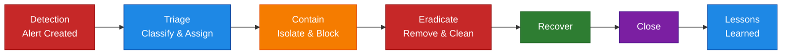

# Incident Response Process

## Document Information

| Item | Details |
|------|---------|
| **Process** | Incident Response |
| **Owner** | Security Operations Team |
| **Last Updated** | YYYY-MM-DD |
| **Version** | 1.0 |

---

## Purpose

This document defines the incident response process for security incidents detected through Microsoft Defender products.

## Scope

This process applies to:

- All security incidents from Defender XDR
- Incidents from individual Defender products (MDE, MDI, MDO, MDCA)
- Correlated cross-product incidents
- Manual incident creation

## Roles and Responsibilities

| Role | Responsibilities |
|------|------------------|
| **Tier 1 Analyst** | Initial triage, data collection, escalation |
| **Tier 2 Analyst** | Investigation, containment, remediation |
| **Tier 3 Analyst** | Advanced investigation, threat hunting |
| **Incident Manager** | Coordination, communication, escalation |
| **Security Lead** | Approval for major actions, management reporting |

## Incident Severity Levels

| Severity | Description | Response Time | Examples |
|----------|-------------|---------------|----------|
| **Critical** | Active attack, data exfiltration | Immediate (< 15 min) | Ransomware, active breach |
| **High** | Confirmed threat, potential impact | < 1 hour | Malware, compromised account |
| **Medium** | Suspicious activity, investigation needed | < 4 hours | Anomalous behavior, policy violation |
| **Low** | Minor issue, low risk | < 24 hours | False positive review, minor alerts |

## Process Flow



## Phase 1: Detection

### Trigger Sources

- Defender XDR unified incidents
- Individual product alerts
- User reports
- External notifications
- Threat hunting findings

### Initial Actions

1. Acknowledge the alert/incident
2. Review initial alert details
3. Check for related alerts
4. Verify this is not a known false positive

## Phase 2: Triage

### Triage Checklist

- [ ] Determine incident severity
- [ ] Identify affected assets (users, devices, data)
- [ ] Check if incident is part of larger attack
- [ ] Review automated investigation results
- [ ] Assign to appropriate analyst

### Classification

| Classification | Description | Action |
|----------------|-------------|--------|
| True Positive | Confirmed threat | Continue investigation |
| False Positive | Benign activity | Document and close |
| Benign True Positive | Expected but flagged | Document and tune |

### Triage Questions

1. What is the attack technique?
2. What assets are affected?
3. What is the potential impact?
4. Is the attack still active?
5. What is the initial vector?

## Phase 3: Containment

### Containment Actions by Product

| Product | Containment Actions |
|---------|-------------------|
| **Defender for Endpoint** | Isolate device, restrict app execution, collect investigation package |
| **Defender for Identity** | Disable user, reset password, force re-authentication |
| **Defender for Office 365** | Delete emails, block sender, quarantine attachments |
| **Defender for Cloud Apps** | Suspend user, revoke sessions, block app |

### Containment Decision Tree

```
Is the attack still active?
├── YES → Immediate containment
│   ├── Isolate affected devices
│   ├── Disable compromised accounts
│   └── Block malicious IPs/URLs
│
└── NO → Planned containment
    ├── Schedule maintenance window
    ├── Prepare communication
    └── Execute controlled containment
```

## Phase 4: Eradication

### Eradication Steps

1. **Remove Malware**
   - Run full antivirus scans
   - Remove malicious files
   - Clean registry entries

2. **Remove Persistence**
   - Check scheduled tasks
   - Review startup items
   - Check service installations

3. **Remove Attacker Access**
   - Reset all potentially compromised credentials
   - Review and remove unauthorized accounts
   - Revoke malicious OAuth apps

4. **Patch Vulnerabilities**
   - Apply security updates
   - Fix misconfigurations
   - Implement missing controls

## Phase 5: Recovery

### Recovery Steps

1. **Restore Systems**
   - Restore from clean backup if needed
   - Rebuild compromised systems
   - Re-image affected devices

2. **Restore Access**
   - Remove device isolation
   - Re-enable user accounts
   - Restore normal access policies

3. **Validate Recovery**
   - Confirm systems are clean
   - Verify normal operation
   - Monitor for reinfection

## Phase 6: Post-Incident

### Lessons Learned

1. **Conduct Review**
   - What happened?
   - How was it detected?
   - What worked well?
   - What could be improved?

2. **Document Findings**
   - Attack timeline
   - Affected assets
   - Root cause
   - Recommendations

3. **Implement Improvements**
   - Update detection rules
   - Improve processes
   - Add new controls
   - Conduct training

### Post-Incident Checklist

- [ ] Incident fully documented
- [ ] Root cause identified
- [ ] Recommendations documented
- [ ] Improvement tasks created
- [ ] Knowledge base updated
- [ ] Detection tuning completed
- [ ] Team debriefing conducted

## Communication

### Internal Communication

| Stakeholder | When to Notify | Method |
|-------------|----------------|--------|
| Security Team | All incidents | Teams/Email |
| IT Management | High/Critical | Email/Call |
| Executive Team | Critical | Call/In-person |
| Legal/Compliance | Data breach | Email/Call |
| HR | Employee involved | Email/Call |

### Communication Template

```
Subject: Security Incident [ID] - [Severity] - [Brief Description]

Summary: [1-2 sentence summary]

Status: [Investigating/Contained/Eradicated/Resolved]

Impact: [Affected systems/users/data]

Actions Taken: [Key actions]

Next Steps: [Planned actions]

ETA for Update: [Timeframe]
```

## Escalation

### Escalation Criteria

| Trigger | Escalate To |
|---------|-------------|
| Incident not contained in SLA | Tier 2/Incident Manager |
| Multiple critical assets affected | Security Lead |
| Potential data breach | Legal/Compliance |
| Executive accounts compromised | CISO |
| Media/public exposure risk | PR/Communications |

## Related Documentation

- [Alert Triage](Alert-Triage.md)
- [Threat Hunting](Threat-Hunting.md)
- [Malware Response](Malware-Response.md)
- [Phishing Response](Phishing-Response.md)

## Malware Incident Response

### Incident Prioritization

Prioritize incidents by filtering on status and **High/Medium Severity**. When navigating incidents, note:
- Severity level
- Investigation state
- Categories (e.g., Command and control, Persistence, Defense evasion)

> **Important:** Remember to manage incidents that aren't resolved. Assign to the right resource and classify based on your investigation. Too much noise makes pivoting difficult.

### Incident Investigation

**Attack Story** - The Incident Graph describes affected entities:
- Affected users and endpoints
- Processes and binaries
- URLs

Each entity and alert can be clicked for additional information. Threat Analytics can provide analyst reports on threat types.

### Recommended Investigation Actions

**A. Validate the alert**
1. Inspect the process as well as the parent process
2. Check for other suspicious activities in the machine timeline
3. Locate unfamiliar processes in the process tree. Check files for prevalence, locations, and digital signatures
4. Submit relevant files for deep analysis and review file behaviors
5. Identify unusual system activity with system owners

**B. Scope the incident**
- Find related machines, network addresses, and files in the incident graph

**C. Contain and mitigate the breach**
- Stop suspicious processes
- Isolate affected machines
- Decommission compromised accounts or reset passwords
- Block IP addresses and URLs
- Install security updates

**D. Escalate if needed**
- Contact your incident response team
- Contact Microsoft support for investigation and remediation services

### Understanding Device Risk Level

When viewing assets of an incident:
- **Risk level** is related to active alerts & incidents
- **Exposure level** is related to security recommendations (configurations, vulnerabilities)

### Device Actions

| Action | Description |
|--------|-------------|
| Run Antivirus Scan | Trigger Full Scan on device |
| [Collect Investigation Package](https://learn.microsoft.com/en-us/microsoft-365/security/defender-endpoint/respond-machine-alerts#collect-investigation-package-from-devices) | Collects: Autoruns (Registry), Installed Programs, Network Connections, Prefetch Files, Processes, Scheduled Tasks, Security Event Log, Services, SMB Sessions, System Information, Temp Directories, Users and Groups, Windows Defender Support Logs |
| [Restrict App Execution](https://learn.microsoft.com/en-us/microsoft-365/security/defender-endpoint/respond-machine-alerts#restrict-app-execution) | Applies code integrity policy allowing only Microsoft-signed files to run |
| [Initiate Automated Investigation](https://learn.microsoft.com/en-us/microsoft-365/security/defender-endpoint/automated-investigations) | Starts general purpose automated investigation on the device |
| [Initiate Live Response Session](https://learn.microsoft.com/en-us/microsoft-365/security/defender-endpoint/live-response) | Remote shell connection for in-depth investigation and immediate response |
| Isolate Device | Disconnects device from network while retaining Defender for Endpoint connectivity |
| Ask Defender Experts | Microsoft MDR team consultation (paid service) |
| [Collect Support Logs](https://learn.microsoft.com/en-us/microsoft-365/security/defender-endpoint/troubleshoot-collect-support-log) | MDE Client Analyzer for Microsoft Support |
| Go Hunt | Navigates to Advanced Hunting with pre-built device query |
| [Turn on troubleshooting mode](https://learn.microsoft.com/en-us/microsoft-365/security/defender-endpoint/enable-troubleshooting-mode) | Enables local troubleshooting for Defender |

## Phishing Incident Response

### Incident Overview & Phishing Playbook

**Attack story** - The Incident Graph describes affected entities:
- User
- Mailbox
- Subject/Mail
- URLs

For step-by-step guidance, open the **Phishing Playbook** in Microsoft 365 Defender.

Detailed guidance including PowerShell commands: https://learn.microsoft.com/en-us/security/operations/incident-response-playbook-phishing

### Phishing Response Phases

#### Contain

- **Which assets are involved?**
  - If an endpoint performed suspicious activity, consider [isolating the device](https://docs.microsoft.com/microsoft-365/security/defender-endpoint/respond-machine-alerts#isolate-devices-from-the-network)
- **Which user accounts are involved and what are their privileges?**
  - Determine if accounts are priority, management, or administrator accounts
- **What containment actions were already taken by automated response?**
  - Check evidence & response tab for [pending approval actions](https://docs.microsoft.com/microsoft-365/security/office-365-security/air-review-approve-pending-completed-actions)

#### Investigate

- **Review the initial phishing email**
  - From the incident, select Evidence and Response tab
  - Find the relevant email and open the email page
  - Check the email header for true source of sender
  - Investigate source IP address using [Threat Analytics](https://security.microsoft.com/threatanalytics3) and [Campaigns](https://security.microsoft.com/campaigns)

- **Did the email contain a URL?**
  - Go to the URL page to get the URL reputation

- **Did the email contain an attachment?**
  - Look for potential malicious content (PDF files, obfuscated PowerShell, other scripts)
  - Check device timeline for payload execution
  - If payload executed, consider isolating the device

- **Get the list of users** who received the phishing email

For each user involved:
- [Investigate the user account](https://docs.microsoft.com/en-us/microsoft-365/security/defender/investigate-users) for suspicious actions
- Check the **investigation priority score**
- If user performed suspicious activity:
  - Contact the user
  - Reset the user account's password
  - Require the user to sign in again

- **Investigate the user account's mailbox**
  - Get the latest dates when the user had access to the mailbox
  - Check for delegated access changes (Activity names: 'Add-MailboxPermission', 'Add-MailboxFolderPermission', 'Set-MailboxFolderPermission')
  - Check for forwarding rules (Activity names: "New-InboxRule", "Set-InboxRule", "Set-Mailbox", "Set-TransportRule", "New-TransportRule")

#### Remediation

- Delete malicious emails from all mailboxes
- Block malicious URLs and attachments
- Reset compromised credentials
- Revoke active sessions
- Check for and remove forwarding rules

#### Prevention

- Review and update anti-phishing policies
- Check Secure Score recommendations
- Conduct user awareness training
- Implement additional technical controls

## Product-Specific Guides

- [Defender XDR Capabilities](../01-Defender-XDR/04-Capabilities.md)
- [Defender for Endpoint Capabilities](../02-Defender-for-Endpoint/04-Capabilities.md)
- [Defender for Identity Capabilities](../03-Defender-for-Identity/04-Capabilities.md)
- [Defender for Office 365 Capabilities](../04-Defender-for-Office-365/04-Capabilities.md)
- [Defender for Cloud Apps Capabilities](../05-Defender-for-Cloud-Apps/04-Capabilities.md)

---

## Document Control

| Version | Date | Author | Changes |
|---------|------|--------|---------|
| 1.0 | YYYY-MM-DD | [Author] | Initial creation |
