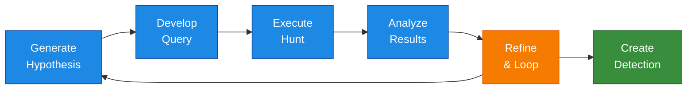

# Threat Hunting Process

## Document Information

| Item | Details |
|------|---------|
| **Process** | Threat Hunting |
| **Owner** | Security Operations Team |
| **Last Updated** | YYYY-MM-DD |
| **Version** | 1.0 |

---

## Purpose

This document defines the proactive threat hunting process using Microsoft Defender products and Advanced Hunting capabilities.

## Scope

This process covers:

- Hypothesis-driven threat hunts
- Intelligence-driven hunts
- Anomaly-based hunting
- Custom detection development

## Hunting Cycle



## Hypothesis Sources

| Source | Description | Example |
|--------|-------------|---------|
| Threat Intelligence | Known TTPs, IOCs, campaigns | APT campaign indicators |
| MITRE ATT&CK | Technique-based hunting | T1059 - Command-Line Interface |
| Threat Analytics | Microsoft threat reports | Active threats in environment |
| Anomaly Detection | Unusual patterns | Abnormal network traffic |
| Security Research | Published research | New attack techniques |
| Previous Incidents | Lessons learned | Similar attack patterns |

## Hunting Data Sources

### Defender XDR Tables

| Table | Data Type | Use Case |
|-------|-----------|----------|
| DeviceProcessEvents | Process execution | Command-line hunting |
| DeviceNetworkEvents | Network connections | C2 hunting |
| DeviceFileEvents | File operations | Malware dropping |
| DeviceRegistryEvents | Registry changes | Persistence hunting |
| DeviceLogonEvents | Logon activity | Credential hunting |
| DeviceImageLoadEvents | DLL loads | Injection hunting |
| EmailEvents | Email metadata | Phishing hunting |
| EmailAttachmentInfo | Attachment details | Malware delivery |
| IdentityLogonEvents | Identity logons | Credential abuse |
| CloudAppEvents | Cloud activity | SaaS hunting |

## Sample Hunting Queries

### Suspicious PowerShell Execution

```kusto
DeviceProcessEvents
| where Timestamp > ago(7d)
| where FileName =~ "powershell.exe" or FileName =~ "pwsh.exe"
| where ProcessCommandLine has_any (
    "-enc", "-encodedcommand", "bypass", "hidden",
    "downloadstring", "iex", "invoke-expression"
)
| project Timestamp, DeviceName, AccountName, ProcessCommandLine
| order by Timestamp desc
```

### LSASS Access Detection

```kusto
DeviceProcessEvents
| where Timestamp > ago(7d)
| where FileName in~ ("mimikatz.exe", "procdump.exe", "dumpert.exe")
    or ProcessCommandLine has_any ("sekurlsa", "lsadump", "lsass")
| project Timestamp, DeviceName, AccountName, FileName, ProcessCommandLine
```

### Suspicious Network Connections

```kusto
DeviceNetworkEvents
| where Timestamp > ago(7d)
| where RemotePort in (4444, 5555, 6666, 8080, 8443)
| where RemoteIPType == "Public"
| summarize ConnectionCount = count() by DeviceName, RemoteIP, RemotePort
| where ConnectionCount > 10
```

### Lateral Movement Detection

```kusto
IdentityLogonEvents
| where Timestamp > ago(7d)
| where LogonType == "RemoteInteractive"
| summarize TargetCount = dcount(TargetDeviceName) by AccountName
| where TargetCount > 5
| order by TargetCount desc
```

### Phishing Email Hunt

```kusto
EmailEvents
| where Timestamp > ago(7d)
| where EmailDirection == "Inbound"
| where SenderFromDomain !in ("trusted-domain.com", "partner.com")
| where Subject has_any ("urgent", "action required", "password", "verify")
| summarize EmailCount = count() by SenderFromAddress, Subject
| order by EmailCount desc
```

## Hunt Documentation

### Hunt Plan Template

```markdown
## Hunt: [Name]

**Hypothesis:** [What are you looking for?]

**Data Sources:** [Tables/logs to query]

**Time Range:** [Hunt period]

**Queries:** [KQL queries used]

**Expected Results:** [What normal looks like]

**Indicators of Compromise:** [What bad looks like]
```

### Hunt Results Template

```markdown
## Hunt Results: [Name]

**Date:** [Date]
**Analyst:** [Name]

**Summary:** [Key findings]

**Findings:**
- Finding 1: [Details]
- Finding 2: [Details]

**Recommendations:**
- [ ] Create detection rule
- [ ] Investigate further
- [ ] No action needed

**New IOCs Discovered:**
| Type | Value | Context |
|------|-------|---------|
```

## Creating Custom Detections

When a hunt identifies a pattern, create a custom detection:

1. Refine query for production use
2. Test for false positive rate
3. Set appropriate severity
4. Configure alert actions
5. Document and publish

### Custom Detection Template

```kusto
// Detection Name: [Name]
// Description: [Description]
// MITRE ATT&CK: [Technique ID]
// Severity: [Low/Medium/High/Critical]

[KQL Query]
| project 
    Timestamp,
    DeviceName,
    AccountName,
    [Additional fields]
```

## Hunting Schedule

| Hunt Type | Frequency | Duration |
|-----------|-----------|----------|
| Intelligence-driven | Weekly | 2-4 hours |
| MITRE-based | Bi-weekly | 4-8 hours |
| Anomaly hunting | Monthly | 8 hours |
| Deep dive | Quarterly | 16+ hours |

## Related Documentation

- [Incident Response](Incident-Response.md)
- [Alert Triage](Alert-Triage.md)
- [Detection Engineering](Detection-Engineering.md)
- [Threat Intelligence](Threat-Intelligence.md)

---

## Document Control

| Version | Date | Author | Changes |
|---------|------|--------|---------|
| 1.0 | YYYY-MM-DD | [Author] | Initial creation |
