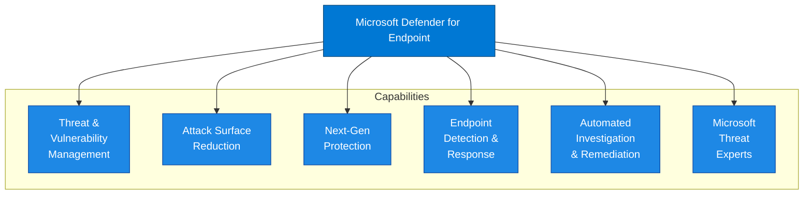

# Microsoft Defender for Endpoint - Overview

## Document Information

| Item | Details |
|------|---------|
| **Product** | Microsoft Defender for Endpoint |
| **Document Type** | Overview |
| **Last Updated** | YYYY-MM-DD |
| **Author** | [Author Name] |
| **Version** | 1.0 |

---

## Executive Summary

Microsoft Defender for Endpoint (MDE) is an enterprise endpoint security platform designed to help organizations prevent, detect, investigate, and respond to advanced threats on endpoints. It provides a comprehensive set of capabilities including next-generation antivirus, endpoint detection and response (EDR), and automated investigation and remediation.

## Purpose

This document provides a high-level overview of Microsoft Defender for Endpoint, including:

- Product capabilities and value proposition
- Supported platforms
- Licensing requirements
- Key use cases

## Scope

### In Scope

- Endpoint protection and detection capabilities
- Device onboarding and management
- Threat and vulnerability management
- Attack surface reduction
- Endpoint detection and response (EDR)

### Out of Scope

- Detailed configuration procedures (see [Low-Level Design](03-Low-Level-Design.md))
- Server-specific configurations
- Mobile device management (Intune)

## Product Description

### What is Defender for Endpoint?

Microsoft Defender for Endpoint is a unified endpoint security platform that provides:

1. **Preventive Protection** - Next-generation antivirus and attack surface reduction
2. **Post-Breach Detection** - Behavioral sensors and cloud-powered analytics
3. **Automated Investigation** - AI-driven investigation and remediation
4. **Threat & Vulnerability Management** - Risk-based vulnerability assessment

### Key Value Propositions

| Value | Description |
|-------|-------------|
| **Unified Platform** | Single agent for prevention, detection, and response |
| **Cloud-Powered** | Leverages Microsoft's vast threat intelligence |
| **Cross-Platform** | Supports Windows, macOS, Linux, iOS, and Android |
| **Native Integration** | Seamless integration with Microsoft 365 security stack |

## Core Capabilities

### Capability Descriptions

| Capability | Description |
|------------|-------------|
| **Threat & Vulnerability Management** | Discover vulnerabilities and misconfigurations in real-time |
| **Attack Surface Reduction** | Reduce attack surface with hardware isolation, application control, and exploit protection |
| **Next-Generation Protection** | Cloud-delivered protection against malware, fileless attacks, and zero-day threats |
| **Endpoint Detection & Response** | Detect and investigate advanced threats with behavioral analytics |
| **Automated Investigation & Remediation** | Automatically investigate alerts and remediate threats at scale |
| **Microsoft Threat Experts** | Managed threat hunting service for additional expertise |

## Supported Platforms

| Platform | Versions | Agent |
|----------|----------|-------|
| Windows | 10, 11, Server 2012 R2+ | Built-in / MDE agent |
| macOS | 11+ (Big Sur) | MDE for Mac |
| Linux | RHEL, Ubuntu, Debian, etc. | MDE for Linux |
| iOS | 14.0+ | Microsoft Defender app |
| Android | 8.0+ | Microsoft Defender app |

## Licensing Requirements

### Plan Comparison

| Feature | Plan 1 | Plan 2 |
|---------|:------:|:------:|
| Next-Generation Protection | ✅ | ✅ |
| Attack Surface Reduction | ✅ | ✅ |
| Device Control | ✅ | ✅ |
| Endpoint Firewall | ✅ | ✅ |
| Endpoint Detection & Response | ❌ | ✅ |
| Threat & Vulnerability Management | ❌ | ✅ |
| Automated Investigation | ❌ | ✅ |
| Advanced Hunting | ❌ | ✅ |
| Live Response | ❌ | ✅ |
| Device Discovery | ❌ | ✅ |
| Threat Intelligence (Threat Analytics) | ❌ | ✅ |
| Microsoft Secure Score for Devices | ❌ | ✅ |
| EDR in Block Mode | ❌ | ✅ |
| Integration with Defender for Cloud Apps | ❌ | ✅ |
| Integration with Defender for Identity | ❌ | ✅ |

### License Options

| License | MDE Coverage |
|---------|--------------|
| Microsoft 365 E5 | Plan 2 (full) |
| Microsoft 365 E5 Security | Plan 2 (full) |
| Microsoft 365 E3 | Plan 1 |
| Defender for Endpoint Plan 1 | Plan 1 |
| Defender for Endpoint Plan 2 | Plan 2 (full) |
| Defender for Business | SMB-focused Plan 2 |

## Key Use Cases

1. **Endpoint Protection**
   - Malware prevention and detection
   - Ransomware protection
   - Zero-day threat protection

2. **Threat Hunting**
   - Proactive threat detection
   - Advanced hunting queries
   - Custom detection rules

3. **Vulnerability Management**
   - Continuous vulnerability assessment
   - Security configuration assessment
   - Risk-based prioritization

4. **Incident Response**
   - Live response for remote investigation
   - Device isolation
   - Forensic collection

5. **Compliance**
   - Security baseline assessment
   - Device compliance reporting
   - Audit and reporting

## Integration Points

| Integration | Purpose |
|-------------|---------|
| Microsoft Defender XDR | Unified incident management |
| Microsoft Intune | Device management and compliance |
| Microsoft Sentinel | SIEM integration |
| Entra ID | Identity context and conditional access |
| Microsoft Defender for Cloud | Server protection |

## Related Documentation

- [High-Level Design](02-High-Level-Design.md)
- [Low-Level Design](03-Low-Level-Design.md)
- [Capabilities](04-Capabilities.md)
- [Device Onboarding Process](../Processes/Device-Onboarding.md)

## References

- [Microsoft Defender for Endpoint Documentation](https://learn.microsoft.com/en-us/microsoft-365/security/defender-endpoint/)
- [What is Microsoft Defender for Endpoint?](https://learn.microsoft.com/en-us/microsoft-365/security/defender-endpoint/microsoft-defender-endpoint)

---

## Document Control

| Version | Date | Author | Changes |
|---------|------|--------|---------|
| 1.0 | YYYY-MM-DD | [Author] | Initial creation |
