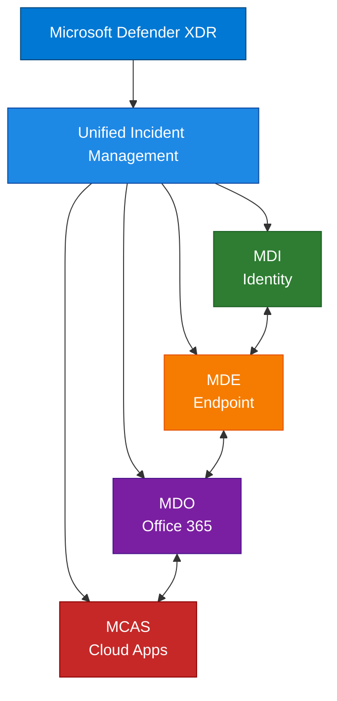

# Microsoft Defender for Identity - High-Level Design

## Document Information

| Item | Details |
|------|---------|
| **Product** | Microsoft Defender for Identity |
| **Document Type** | High-Level Design |
| **Last Updated** | YYYY-MM-DD |
| **Author** | [Author Name] |
| **Version** | 1.0 |

---

## Purpose

This document describes the high-level architecture and design of Microsoft Defender for Identity, including major components, data flows, and integration points.

## Architecture Overview

### Conceptual Architecture

```
┌──────────────────────────────────────────────────────────────────────────────┐
│                         Microsoft Cloud Services                              │
│                                                                               │
│  ┌─────────────────────────────────────────────────────────────────────────┐ │
│  │                Microsoft Defender for Identity Cloud                     │ │
│  │  ┌─────────────┐ ┌─────────────┐ ┌─────────────┐ ┌─────────────────┐   │ │
│  │  │ Detection   │ │ Analytics   │ │ Machine     │ │ Threat          │   │ │
│  │  │ Engine      │ │ Engine      │ │ Learning    │ │ Intelligence    │   │ │
│  │  └─────────────┘ └─────────────┘ └─────────────┘ └─────────────────┘   │ │
│  │                                                                          │ │
│  │  ┌─────────────────────────────────────────────────────────────────┐    │ │
│  │  │            MDI Portal (security.microsoft.com)                   │    │ │
│  │  └─────────────────────────────────────────────────────────────────┘    │ │
│  └─────────────────────────────────────────────────────────────────────────┘ │
│                                     ▲                                         │
└─────────────────────────────────────┼─────────────────────────────────────────┘
                                      │ HTTPS (443)
                                      │
┌─────────────────────────────────────┼─────────────────────────────────────────┐
│                      Customer On-Premises Network                              │
│                                     │                                          │
│  ┌───────────────────────────────────────────────────────────────────────┐    │
│  │                        Active Directory Forest                         │    │
│  │  ┌─────────────┐  ┌─────────────┐  ┌─────────────┐  ┌─────────────┐   │    │
│  │  │    DC1      │  │    DC2      │  │    DC3      │  │    RODC     │   │    │
│  │  │  + Sensor   │  │  + Sensor   │  │  + Sensor   │  │  + Sensor   │   │    │
│  │  └─────────────┘  └─────────────┘  └─────────────┘  └─────────────┘   │    │
│  └───────────────────────────────────────────────────────────────────────┘    │
│                                                                                │
│  ┌───────────────────────────────────────────────────────────────────────┐    │
│  │                        AD FS Servers (Optional)                        │    │
│  │  ┌─────────────┐  ┌─────────────┐                                     │    │
│  │  │   ADFS1     │  │   ADFS2     │                                     │    │
│  │  │  + Sensor   │  │  + Sensor   │                                     │    │
│  │  └─────────────┘  └─────────────┘                                     │    │
│  └───────────────────────────────────────────────────────────────────────┘    │
└────────────────────────────────────────────────────────────────────────────────┘
```

### Sensor Architecture

```
┌─────────────────────────────────────────────────────────────────────────────┐
│                      Domain Controller with MDI Sensor                       │
├─────────────────────────────────────────────────────────────────────────────┤
│                                                                              │
│  ┌─────────────────────────────────────────────────────────────────────┐    │
│  │                    MDI Sensor Service                                │    │
│  │  ┌─────────────┐  ┌─────────────┐  ┌─────────────┐  ┌───────────┐   │    │
│  │  │   Network   │  │   Event     │  │   ETW       │  │  Parser   │   │    │
│  │  │   Listener  │  │   Listener  │  │   Listener  │  │  Engine   │   │    │
│  │  └─────────────┘  └─────────────┘  └─────────────┘  └───────────┘   │    │
│  └────────────────────────────────────────┬────────────────────────────┘    │
│                                           │                                  │
│  ┌────────────────────────────────────────┼────────────────────────────┐    │
│  │                    Data Sources        │                             │    │
│  │  ┌─────────────┐  ┌─────────────┐  ┌───┴───────┐  ┌─────────────┐   │    │
│  │  │  Network    │  │  Windows    │  │   ETW     │  │    AD       │   │    │
│  │  │  Traffic    │  │  Events     │  │  Traces   │  │   Data      │   │    │
│  │  │  (Port 389, │  │  (4624,     │  │           │  │             │   │    │
│  │  │   636, etc) │  │   4776...)  │  │           │  │             │   │    │
│  │  └─────────────┘  └─────────────┘  └───────────┘  └─────────────┘   │    │
│  └──────────────────────────────────────────────────────────────────────┘    │
│                                                                              │
└─────────────────────────────────────────────────────────────────────────────┘
```

## Data Flow Architecture

### Detection Data Flow

```
┌───────────────┐     ┌──────────────┐     ┌───────────────┐     ┌──────────────┐
│  AD Network   │────▶│   MDI        │────▶│    Cloud      │────▶│   Detection  │
│  Traffic      │     │   Sensor     │     │   Service     │     │   Engine     │
└───────────────┘     └──────────────┘     └───────────────┘     └──────────────┘
                                                                        │
┌───────────────┐     ┌──────────────┐     ┌───────────────┐            │
│  Windows      │────▶│   MDI        │────▶│    Cloud      │            │
│  Events       │     │   Sensor     │     │   Service     │────────────┤
└───────────────┘     └──────────────┘     └───────────────┘            │
                                                                        ▼
                                                              ┌──────────────┐
                                                              │   Alert      │
                                                              │   Generation │
                                                              └──────────────┘
                                                                        │
                                                                        ▼
                                                              ┌──────────────┐
                                                              │  Defender    │
                                                              │  XDR Portal  │
                                                              └──────────────┘
```

### Learning Flow

```
┌─────────────────────────────────────────────────────────────────────────────┐
│                         User Behavior Analytics                              │
├─────────────────────────────────────────────────────────────────────────────┤
│                                                                              │
│  ┌─────────────┐     ┌─────────────┐     ┌─────────────┐     ┌───────────┐  │
│  │  Collect    │────▶│   Profile   │────▶│   Baseline  │────▶│  Detect   │  │
│  │  Activities │     │   Building  │     │   Learning  │     │  Anomaly  │  │
│  │             │     │   (30 days) │     │             │     │           │  │
│  └─────────────┘     └─────────────┘     └─────────────┘     └───────────┘  │
│                                                                              │
│  Activities Collected:                                                       │
│  • Authentication attempts                                                   │
│  • Resource access                                                          │
│  • Group membership queries                                                 │
│  • Computer access patterns                                                 │
│  • Lateral movement patterns                                                │
│                                                                              │
└─────────────────────────────────────────────────────────────────────────────┘
```

## Major Components

### 1. MDI Sensor

| Component | Purpose |
|-----------|---------|
| Network Listener | Captures LDAP, Kerberos, DNS, RPC traffic |
| Event Listener | Captures Windows Security events |
| ETW Listener | Captures Event Tracing for Windows data |
| Parser Engine | Parses and normalizes collected data |
| Cloud Connector | Sends data to cloud service |

### 2. Cloud Service

| Component | Purpose |
|-----------|---------|
| Detection Engine | Runs detection algorithms |
| Machine Learning | Behavioral analysis and anomaly detection |
| User Profiling | Builds user behavior profiles |
| Entity Resolution | Links related entities together |
| Alert Management | Generates and manages alerts |

### 3. Portal Interface

| Feature | Description |
|---------|-------------|
| Dashboard | Overview of security status |
| Alerts | View and manage security alerts |
| User Timeline | Detailed user activity view |
| Entity Profiles | User and computer profiles |
| Reports | Security assessment reports |

## Network Architecture

### Required Connectivity

```
┌──────────────────────────────────────────────────────────────────────────┐
│                          Network Requirements                             │
├──────────────────────────────────────────────────────────────────────────┤
│                                                                           │
│  MDI Sensor ──────────────────────────────▶ Microsoft Cloud              │
│              │                               │                            │
│              │  HTTPS (TCP 443)              │  *. atp.azure.com          │
│              │                               │  *.azureedge.net           │
│              │                               │  *.blob.core.windows.net   │
│              │                               │                            │
│              │                               │                            │
│  MDI Sensor ◀──────────────────────────────▶ Domain Controllers          │
│              │                               │                            │
│              │  Ports: 389, 636, 3268, 3269  │  LDAP/LDAPS               │
│              │  Ports: 88                     │  Kerberos                 │
│              │  Ports: 445                    │  SMB                      │
│              │  Ports: 135, RPC Dynamic       │  RPC                      │
│              │                               │                            │
└──────────────────────────────────────────────────────────────────────────┘
```

### Sensor Network Requirements

| From | To | Ports | Purpose |
|------|-----|-------|---------|
| Sensor | Cloud | 443 | Cloud communication |
| Sensor | DCs | 389, 636 | LDAP queries |
| Sensor | DCs | 88 | Kerberos |
| Sensor | DCs | 445 | SMB |
| Sensor | DNS | 53 | DNS resolution |

## Integration Design

### Defender XDR Integration



### Identity Correlation

| Signal | Correlation Point |
|--------|-------------------|
| Device alerts (MDE) | User logged on device |
| Email alerts (MDO) | User mailbox |
| Cloud app activity (MCAS) | User account |
| On-premises activity (MDI) | AD user account |

## Security Considerations

### Sensor Security

| Aspect | Implementation |
|--------|----------------|
| Service Account | Group Managed Service Account (gMSA) |
| Permissions | Read-only AD access |
| Network | Encrypted communication |
| Data | No data stored locally |

### Data Protection

| Aspect | Implementation |
|--------|----------------|
| Data in Transit | TLS 1.2+ |
| Data at Rest | Azure encryption |
| Data Residency | Regional storage |
| Retention | 180 days |

## Dependencies

### Technical Dependencies

| Dependency | Requirement |
|------------|-------------|
| Active Directory | Windows Server 2008 R2+ |
| Domain Controller | All DCs need sensors |
| Network | HTTPS to Microsoft |
| .NET Framework | 4.7+ on sensors |

### Service Dependencies

| Service | Impact if Unavailable |
|---------|----------------------|
| Cloud Service | No new detections |
| Active Directory | No data collection |
| Network | No cloud communication |

## Related Documentation

- [Overview](01-Overview.md)
- [Low-Level Design](03-Low-Level-Design.md)
- [Capabilities](04-Capabilities.md)

---

## Document Control

| Version | Date | Author | Changes |
|---------|------|--------|---------|
| 1.0 | YYYY-MM-DD | [Author] | Initial creation |
