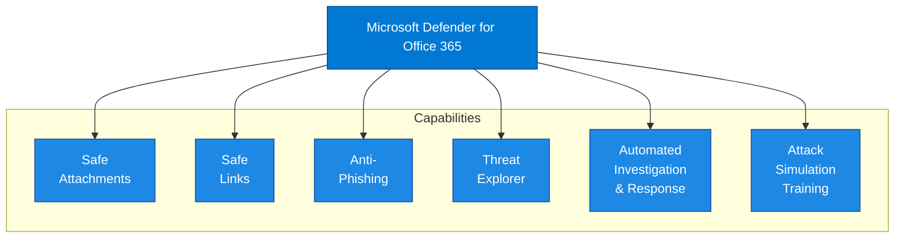

# Microsoft Defender for Office 365 - Overview

## Document Information

| Item | Details |
|------|---------|
| **Product** | Microsoft Defender for Office 365 |
| **Document Type** | Overview |
| **Last Updated** | YYYY-MM-DD |
| **Author** | [Author Name] |
| **Version** | 1.0 |

---

## Executive Summary

Microsoft Defender for Office 365 (MDO) is a cloud-based email filtering service that protects organizations against advanced threats to email and collaboration tools. It provides protection against phishing, business email compromise, malware, and other threats in email messages, links (URLs), and collaboration tools like Microsoft Teams, SharePoint, and OneDrive.

## Purpose

This document provides a high-level overview of Microsoft Defender for Office 365, including:

- Product capabilities and value proposition
- Protection mechanisms
- Licensing requirements
- Key use cases

## Scope

### In Scope

- Email protection (Exchange Online)
- Safe Links and Safe Attachments
- Anti-phishing protection
- Threat investigation and response
- Attack simulation training

### Out of Scope

- Exchange Online Protection (EOP) basic features
- Detailed configuration procedures (see [Low-Level Design](03-Low-Level-Design.md))
- On-premises Exchange protection

## Product Description

### What is Defender for Office 365?

Microsoft Defender for Office 365 extends Exchange Online Protection with:

1. **Advanced Threat Protection** - Protection against zero-day malware and phishing
2. **Safe Links** - Time-of-click URL protection
3. **Safe Attachments** - Sandbox analysis of attachments
4. **Post-Breach Capabilities** - Investigation and automated response

### Key Value Propositions

| Value | Description |
|-------|-------------|
| **Advanced Protection** | Zero-day threat protection beyond basic filtering |
| **Real-time Protection** | Time-of-click URL verification |
| **AI-Powered Detection** | Machine learning-based phishing detection |
| **Integrated Response** | Automated investigation and remediation |

## Core Capabilities



### Capability Descriptions

| Capability | Description |
|------------|-------------|
| **Safe Attachments** | Detonates attachments in sandbox to detect unknown malware |
| **Safe Links** | Rewrites URLs to verify safety at time of click |
| **Anti-Phishing** | ML-based protection against impersonation and BEC |
| **Threat Explorer** | Real-time investigation and threat hunting |
| **Automated Investigation** | AI-driven investigation of alerts |
| **Attack Simulation** | Phishing simulation for user training |

## Protection Layers

```
┌─────────────────────────────────────────────────────────────────┐
│                      Inbound Email Flow                          │
├─────────────────────────────────────────────────────────────────┤
│                                                                  │
│  Internet ──▶ ┌────────────────────────────────────────────────┐│
│               │              Connection Filtering               ││
│               │         (IP reputation, sender filtering)       ││
│               └─────────────────────┬──────────────────────────┘│
│                                     ▼                            │
│               ┌────────────────────────────────────────────────┐│
│               │            Anti-Malware Scanning                ││
│               │         (Known malware signatures)              ││
│               └─────────────────────┬──────────────────────────┘│
│                                     ▼                            │
│               ┌────────────────────────────────────────────────┐│
│               │              Policy Filtering                   ││
│               │      (Transport rules, spam filtering)          ││
│               └─────────────────────┬──────────────────────────┘│
│                                     ▼                            │
│               ┌────────────────────────────────────────────────┐│
│               │            Safe Attachments (P1)                ││
│               │         (Sandbox detonation)                    ││
│               └─────────────────────┬──────────────────────────┘│
│                                     ▼                            │
│               ┌────────────────────────────────────────────────┐│
│               │              Safe Links (P1)                    ││
│               │         (URL rewriting & verification)          ││
│               └─────────────────────┬──────────────────────────┘│
│                                     ▼                            │
│               ┌────────────────────────────────────────────────┐│
│               │           Anti-Phishing (P1/P2)                 ││
│               │    (Impersonation, spoofing protection)         ││
│               └─────────────────────┬──────────────────────────┘│
│                                     ▼                            │
│                              Mailbox Delivery                    │
│                                                                  │
└─────────────────────────────────────────────────────────────────┘
```

## Licensing Requirements

### Plan Comparison

| Feature | Plan 1 | Plan 2 |
|---------|:------:|:------:|
| Safe Attachments | ✅ | ✅ |
| Safe Links | ✅ | ✅ |
| Anti-phishing (impersonation) | ✅ | ✅ |
| Real-time detections | ✅ | ✅ |
| Safe Documents | ❌ | ✅ |
| Threat Explorer | ❌ | ✅ |
| Automated Investigation & Response | ❌ | ✅ |
| Attack Simulation Training | ❌ | ✅ |
| Threat Trackers | ❌ | ✅ |
| Campaign Views | ❌ | ✅ |

### Defender for Office 365 Plan 2 Features

The following features are additional to Plan 2 compared to Plan 1:

| Feature | Description |
|---------|-------------|
| [Campaign Views](https://learn.microsoft.com/en-us/microsoft-365/security/office-365-security/campaigns) | Identified, coordinated phishing and malware email attacks |
| [Threat Trackers](https://docs.microsoft.com/en-us/office365/servicedescriptions/office-365-advanced-threat-protection-service-description#threat-trackers) | Informative widgets providing intelligence on cybersecurity issues |
| [Threat Explorer](https://learn.microsoft.com/en-us/microsoft-365/security/office-365-security/real-time-detections) | Real-time investigation and hunting capabilities |
| [Automated Investigation & Response](https://docs.microsoft.com/en-us/office365/servicedescriptions/office-365-advanced-threat-protection-service-description#automated-incident-response) | AI-driven investigation and remediation |
| [Attack Simulator Training](https://docs.microsoft.com/en-us/office365/servicedescriptions/office-365-advanced-threat-protection-service-description#attack-simulator) | Phishing simulations and security awareness training |

### License Options

| License | MDO Coverage |
|---------|--------------|
| Microsoft 365 E5 | Plan 2 (full) |
| Microsoft 365 E5 Security | Plan 2 (full) |
| Office 365 E5 | Plan 2 (full) |
| Microsoft 365 Business Premium | Plan 1 |
| Defender for Office 365 Plan 1 | Plan 1 |
| Defender for Office 365 Plan 2 | Plan 2 (full) |

## Key Use Cases

1. **Advanced Email Protection**
   - Zero-day malware protection
   - Targeted phishing defense
   - Business email compromise prevention

2. **URL Protection**
   - Time-of-click verification
   - Malicious link blocking
   - URL detonation

3. **Threat Investigation**
   - Email threat hunting
   - Campaign analysis
   - Threat intelligence

4. **User Awareness**
   - Phishing simulations
   - Security training
   - Behavioral analytics

5. **Automated Response**
   - Auto-remediation of threats
   - Soft delete malicious emails
   - Coordinated response actions

## Integration Points

| Integration | Purpose |
|-------------|---------|
| Microsoft Defender XDR | Unified incident management |
| Exchange Online | Email protection |
| Microsoft Teams | Collaboration protection |
| SharePoint/OneDrive | File protection |
| Microsoft Sentinel | SIEM integration |

## Related Documentation

- [High-Level Design](02-High-Level-Design.md)
- [Low-Level Design](03-Low-Level-Design.md)
- [Capabilities](04-Capabilities.md)
- [Phishing Response Process](../Processes/Phishing-Response.md)

## References

- [Microsoft Defender for Office 365 Documentation](https://learn.microsoft.com/en-us/microsoft-365/security/office-365-security/)
- [What is Microsoft Defender for Office 365?](https://learn.microsoft.com/en-us/microsoft-365/security/office-365-security/defender-for-office-365)

---

## Document Control

| Version | Date | Author | Changes |
|---------|------|--------|---------|
| 1.0 | YYYY-MM-DD | [Author] | Initial creation |
