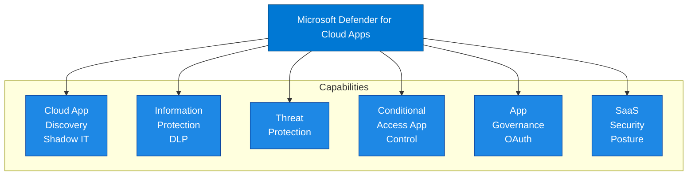
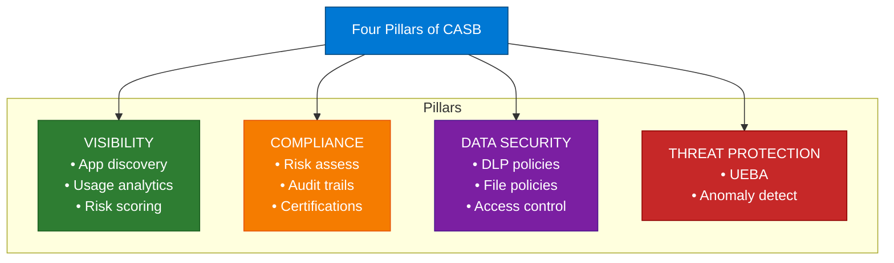

# Microsoft Defender for Cloud Apps - Overview

## Document Information

| Item | Details |
|------|---------|
| **Product** | Microsoft Defender for Cloud Apps |
| **Document Type** | Overview |
| **Last Updated** | YYYY-MM-DD |
| **Author** | [Author Name] |
| **Version** | 1.0 |

---

## Executive Summary

Microsoft Defender for Cloud Apps (MDCA), formerly known as Microsoft Cloud App Security (MCAS), is a Cloud Access Security Broker (CASB) that provides visibility, control over data travel, and sophisticated analytics to identify and combat cyberthreats across all Microsoft and third-party cloud services.

## Purpose

This document provides a high-level overview of Microsoft Defender for Cloud Apps, including:

- Product capabilities and value proposition
- Architecture components
- Licensing requirements
- Key use cases

## Product Description

### What is Defender for Cloud Apps?

Microsoft Defender for Cloud Apps is a multi-mode CASB that provides:

1. **Visibility** - Discover all cloud apps in use (Shadow IT)
2. **Data Security** - Protect sensitive data across cloud apps
3. **Threat Protection** - Detect suspicious user activities
4. **Compliance** - Assess and enforce compliance requirements

### Key Value Propositions

| Value | Description |
|-------|-------------|
| **Shadow IT Discovery** | Discover 31,000+ cloud apps in use |
| **Data Protection** | Control sensitive data across SaaS apps |
| **Threat Detection** | Identify risky user behavior and threats |
| **App Governance** | Control OAuth app permissions |

## Core Capabilities

### Capability Descriptions

| Capability | Description |
|------------|-------------|
| **Cloud Discovery** | Discover and assess 31,000+ cloud apps |
| **Information Protection** | Apply labels and DLP policies to cloud data |
| **Threat Detection** | Detect anomalous user behavior and threats |
| **Conditional Access App Control** | Real-time session monitoring and control |
| **App Governance** | Control OAuth app permissions and access |
| **SaaS Security Posture** | Assess and remediate SaaS misconfigurations |

## CASB Pillars

## Supported Applications

### API Connectors (Full Integration)

| Application | Visibility | Control | Governance |
|-------------|:----------:|:-------:|:----------:|
| Microsoft 365 | ✅ | ✅ | ✅ |
| Azure | ✅ | ✅ | ✅ |
| Salesforce | ✅ | ✅ | ✅ |
| Box | ✅ | ✅ | ✅ |
| Dropbox | ✅ | ✅ | ✅ |
| Google Workspace | ✅ | ✅ | ✅ |
| ServiceNow | ✅ | ✅ | ✅ |
| Okta | ✅ | ✅ | ✅ |
| GitHub | ✅ | ✅ | ✅ |
| AWS | ✅ | ✅ | ✅ |

### Conditional Access App Control

- Any SAML 2.0 or OIDC application
- Any application federated with Entra ID
- On-premises apps via App Proxy

## Licensing Requirements

### Required Licenses

| License | MDCA Coverage |
|---------|:-------------:|
| Microsoft 365 E5 | ✅ Full |
| Microsoft 365 E5 Security | ✅ Full |
| Enterprise Mobility + Security E5 | ✅ Full |
| Defender for Cloud Apps (standalone) | ✅ Full |
| Microsoft 365 E3 | ⚠️ Discovery Only |

### Feature Availability

| Feature | E3 | E5/Standalone |
|---------|:--:|:-------------:|
| Cloud App Discovery | ✅ | ✅ |
| App Connectors | ❌ | ✅ |
| Conditional Access App Control | ❌ | ✅ |
| Information Protection | ❌ | ✅ |
| Threat Detection | ❌ | ✅ |
| App Governance | ❌ | ✅ Add-on |

## Governance

- [Discover and assess cloud apps](https://learn.microsoft.com/en-us/defender-cloud-apps/discovery-detect)
- [Apply cloud governance policies](https://learn.microsoft.com/en-us/defender-cloud-apps/governance-discovery)

## Security Posture

- [Block and protect download of sensitive data to unmanaged or risky devices](https://learn.microsoft.com/en-us/defender-cloud-apps/session-controls)
- [Detect cloud threats, compromised accounts, malicious insiders, and ransomware](https://learn.microsoft.com/en-us/defender-cloud-apps/investigate)
- [Use the audit trail of activities for forensic investigations](https://learn.microsoft.com/en-us/defender-cloud-apps/activity-log)
- [Secure collaboration with external users by enforcing real-time session controls](https://learn.microsoft.com/en-us/defender-cloud-apps/governance-discovery)
- [Secure IaaS services and custom apps](https://learn.microsoft.com/en-us/defender-cloud-apps/protect-iaas)

## Information Protection

- [Discover, classify, label, and protect regulated and sensitive data stored in the cloud](https://learn.microsoft.com/en-us/defender-cloud-apps/information-protection)
- [Enforce DLP and compliance policies for data stored in the cloud](https://learn.microsoft.com/en-us/defender-cloud-apps/data-protection-policies)
- [Limit exposure of shared data and enforce collaboration policies](https://learn.microsoft.com/en-us/defender-cloud-apps/governance)

---

## Example capabilities

### Cloud Discovery

- All traffic on endpoints is monitored  
- Discovered apps based on Risk Score  
- Shadow IT Discovery  
- High-risk Cloud Storage entities  
- Insider Threat – Search for specific users and activities  

### Conditional Access App Control (MDA)

- All traffic will be monitored and discovered.  
  - Targets both managed and BYOD-devices based on CA-rule.  
  - Commonly used to block downloads based on properties and file management status (BYOD).  
- Alternative is to only use App Enforced Restrictions  
  - Used, for example, to block file downloads towards unmanaged devices  

### Investigation

- oAuth Apps  
- Activity Log  
  - Includes every activity in integrated cloud apps  
  - For example, when a Global Admin is created  
- Files (SharePoint)  
  - Public (Internet)  
  - External (Guests)

## Integration Points

| Integration | Purpose |
|-------------|---------|
| Microsoft Defender XDR | Unified incident management |
| Entra ID | Identity and conditional access |
| Microsoft Purview | Information protection |
| Microsoft Sentinel | SIEM integration |
| Defender for Endpoint | Endpoint-based discovery and blocking |

## Related Documentation

- [High-Level Design](02-High-Level-Design.md)
- [Low-Level Design](03-Low-Level-Design.md)
- [Capabilities](04-Capabilities.md)
- [Cloud App Security Process](../Processes/Cloud-App-Security.md)

## References

- [Microsoft Defender for Cloud Apps Documentation](https://learn.microsoft.com/en-us/defender-cloud-apps/)
- [What is Defender for Cloud Apps?](https://learn.microsoft.com/en-us/defender-cloud-apps/what-is-defender-for-cloud-apps)

---

## Document Control

| Version | Date | Author | Changes |
|---------|------|--------|---------|
| 1.0 | YYYY-MM-DD | [Author] | Initial creation |
